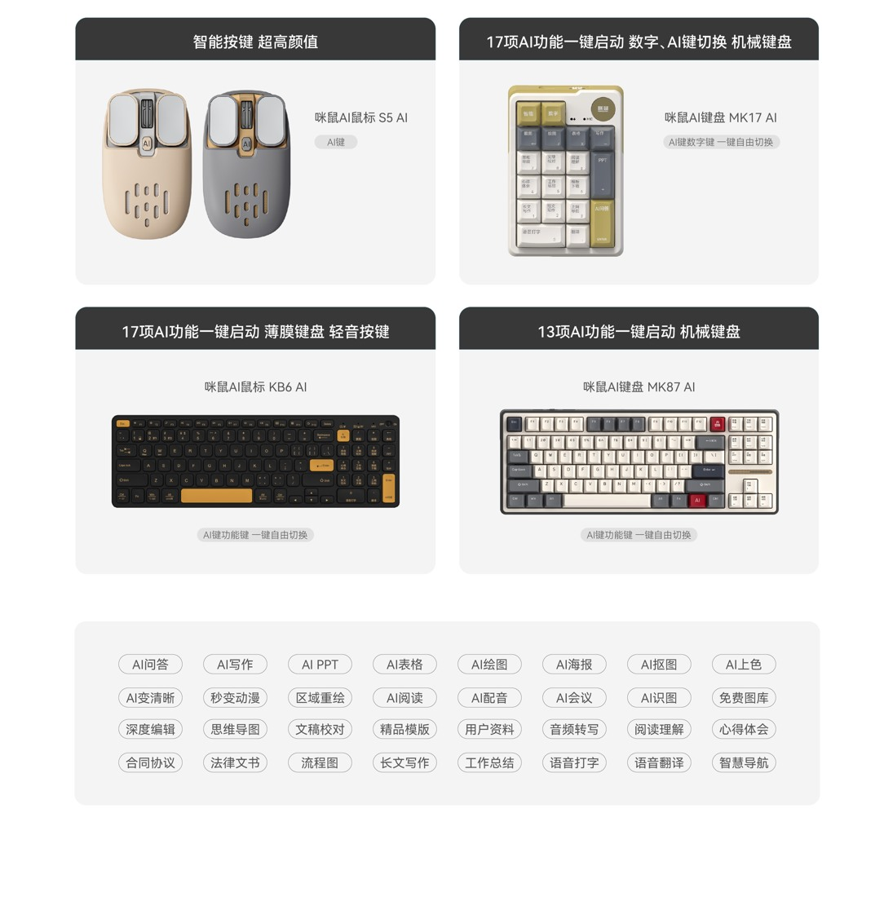
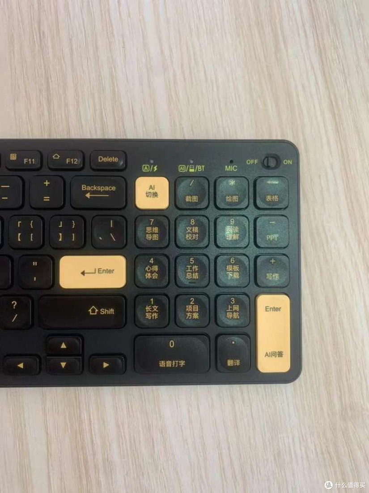

Checked: 2026-10-06. Do not conflate keyboards and mice with standalone agents, or historical launch prices with current quotes. This round used public-source research; no hardware was purchased or connected.

## Conclusions

Chinese manufacturers have already built three distinct kinds of products: (1) full keyboards/numeric keypads with AI function areas (MiMouse); (2) keyboards and mice with voice/AI access plus office software (iFLYTEK, MiMouse, Lenovo); and (3) dedicated button-equipped microphones/lavalier microphones that can control agent sessions (Ulanzi, Hollyland). The comparison below separates full keyboards, standalone numeric keypads, mice and voice-control peripherals.

This dossier focuses on **MiMouse KB6 AI, MK17 AI “Little 17,” and MK87 AI; iFLYTEK T8 Spark Edition and the AM50 series; Lenovo N911S Dual-Mode AI Edition; Ulanzi AU05-X and Hollyland LARK A2**. These are not all direct equivalents: STT input, preset-function invocation, selected-content context, and agent control occupy different capability levels.

## 1. MiMouse: Start with Keyboards, Then Mice and Software

MiMouse (咪鼠) is Hefei MiMouse Technology, not Xiaomi. Its current official website lists AI Office Software 6.0 as released in July 2026. Products shown for sale on the homepage include M7C, M4 AI, KB6 AI, and MK17 AI; the operating tutorials also list MK87 AI. [M01](https://www.mimouse.com/), [M02](https://www.mimouse.com/video.html?type=keyboard)

| Model | Hardware and connectivity | Buttons/AI access | Systems and software | Commercial status and limitations |
|---|---|---|---|---|
| **KB6 AI** | Slim 96-key office keyboard; 2.4G + dual Bluetooth, Type-C charging | Switches between the numeric area and 17 AI functions; voice key/microphone; shortcuts for writing, PPT, spreadsheets, drawing, translation, screenshots, etc. | The 2024 official page lists Win7/8/10/11, Mac10.15+, and some Chinese operating systems; the current homepage says it can access AI6.0 | Officially introduced on 2024-10-09, with physical unboxings/use already documented; not a concept. Dual-mode connectivity does not mean identical AI capabilities on every platform [M03](https://www.mimouse.com/news_detail.html?newsId=182) |
| **MK17 AI / Little 17** | 19-key mechanical numeric keypad with 17 smart keys; 133×90×40mm, 198g; wired/2.4G/Bluetooth5.0 | One-button switching between numeric/AI modes; puts frequent functions within reach without replacing the main keyboard | Official specifications: Win7/8/10/11 (no Bluetooth on Win7), Mac10.15+; requires the MiMouse client | Real commercial product with official specifications and historical user unboxings. Some official headings still say MK1, but the body explicitly identifies MK17 AI; do not misidentify it when citing [M04](https://www.mimouse.net/MK17AI_D.html), [M05](https://www.mimouse.com/news_detail.html?newsId=199) |
| **MK87 AI** | Full mechanical keyboard, with official product/operating videos available | Combines AI-function access with ordinary typing; it is not MK17's full name or the same device | Win/Mac software-download tutorials exist; this round did not verify a version-by-version feature matrix | Physical hands-on reports exist; not merely a launch-event concept. Do not transplant mixed 87/98-key comments about other keyboards onto this model [M02](https://www.mimouse.com/video.html?type=keyboard), [M06](https://www.mimouse.net/MK87AI.html) |
| **M7C AI** | AI mouse currently featured on the official website | Buttons + voice; rewrite/translate selected text; agent access can be assigned to a button | MiMouse AI6.0; official download options point to Windows/macOS/Chinese Linux systems | Currently shown officially. This round found no ordinary users' long-term usage evidence, platform-specific permission details, or inventory verification; do not invent DPI/battery specifications [M01](https://www.mimouse.com/) |
| **M4 AI** | Established older AI mouse; official instructions cover receiver/dual-Bluetooth operation | Mouse AI button opens the client; voice/selection/screenshot capabilities depend on software version | The Mac manual requires Accessibility and Input Monitoring permissions; pairing Bluetooth does not automatically enable every AI function | The older manual covers AI2.0 and cannot be treated as a hands-on test of M7C or 6.0 [M07](https://www.mimouse.com/userRules.html) |

*MiMouse official hardware range: distinct keyboard and mouse forms, not evidence of a shared software version. [Source](https://www.mimouse.com/ai_hardware.html).*

*Actual KB6 device photograph from a third-party 2024 article; this historical experience does not establish the 2026 AI 6.0 version. [Source](https://post.smzdm.com/p/a7ppke39/).*

### How These Products Are Actually Used

**A. Dictating into the current input position (functional chain)**
Connect the hardware to the computer → install the matching client and grant necessary microphone/system permissions → place the cursor in an email, document, or chat input field → press the voice key and speak → recognition output enters the input workflow → manually check proper names, numbers, and punctuation. The benefit is keeping the input action at hand; it does not necessarily read the entire email, current project, or background agent state. [M01](https://www.mimouse.com/), [M07](https://www.mimouse.com/userRules.html)

**B. Selected text → rewriting/translation (current official 6.0 capability)**
Select text in an application → activate the text assistant and say, for example, “make the tone formal/compress it to 100 Chinese characters” → the software passes in the selected text and calls the model → inspect the result. This is a shorter entry path than opening an empty chat window. This round did not test whether every app supports automatic in-place replacement or how undo works, so it does not claim “precise write-back in any application.” [M01](https://www.mimouse.com/)

**C. Generating a Van Gogh PPT with KB6 (real public demonstration, older version)**
In an illustrated post dated 2024-10-11, ide0007 used the PPT entry point and dictated a topic → the AI produced an editable outline → divided it into slides → the user chose a template → generated the deck. The author liked the simple steps, but noted that the resulting deck at the time lacked the corresponding tables and illustrations: these had to be generated separately with AI spreadsheet/drawing functions and then inserted. **This observation dates from the AI2.0 period; it cannot establish that 6.0 still behaves that way in 2026**. The current official website advertises generating text, images, and charts together; the actual improvement needs hardware-based verification. [U01](https://www.zhihu.com/tardis/bd/art/939750605), [M01](https://www.mimouse.com/)

**D. Using MK17 as an external “function pad”**
Keep the original mechanical keyboard → place Little 17 beside the left or right hand → enter spreadsheet data in numeric mode, or switch to AI mode for writing/translation/Q&A → state the goal by voice → the client processes it. The difference lies in physical layout and the cost of discovering functions; 17 preset entry points do not equal 17 independently running agents. In a physical hands-on report, the author “Panda” found the three connection modes and knob convenient, but the keyboard angle could not be adjusted. There is no long-term failure-rate evidence. [M04](https://www.mimouse.net/MK17AI_D.html), [M05](https://www.mimouse.com/news_detail.html?newsId=199), [U02](https://post.smzdm.com/p/avpqo349/)

**E. Binding agents such as WorkBuddy (current manufacturer claim)**
Configure frequently used agents in MiMouse software → bind them to physical buttons → press a button to launch and dictate a request. The current official website lists WorkBuddy, Doubao, Qwen, and custom assistants; this is a verifiable product claim. **No public protocol documentation was found demonstrating that MiMouse can read every agent's current task, pending approval actions, selected objects, or execution boundaries**. Do not upgrade “launch/voice control” into a claim of general-purpose context routing. [M01](https://www.mimouse.com/)

### MiMouse Feedback Evidence, Rather Than Brand Approval Rates

| Author/date | Actual scenario | What they liked | Pain points/limitations | Source credibility |
|---|---|---|---|---|
| ide0007, Zhihu, 2024-10-11, AI2.0 | KB6 voice-generated Van Gogh PPT, training-plan spreadsheet, images | One-button access from the AI area, intuitive generation flow; liked the feel and dual-system switching | PPT lacked images/tables at the time, requiring separate creation; problems generating text inside images | First-person illustrated account with a strongly promotional tone; commercial relationship undisclosed; use only as historical experience [U01](https://www.zhihu.com/tardis/bd/art/939750605) |
| Self-identified “Panda” in the article, SMZDM, around 2024 (search returned only approximately 2.3 years ago; exact date unverified) | Physical MK17 use across its three connection modes, voice, and keyboard operation | Receiver storage, knob, voice, and function shortcuts | Angle cannot be adjusted | Illustrated physical-device account; not described as an independent self-funded purchase; sponsorship unknown [U02](https://post.smzdm.com/p/avpqo349/) |
| SMZDM a2x0pow2, around 2024-10-08 (image date), author unverified | KB6 translating selected foreign-language text, voice input, article generation | Convenient press-and-hold voice input and short selected-text translation path | At the time, the article said video-subtitle translation and speech-recognition translation were unsupported | Date needs confirmation from the body; older feature boundaries cannot be directly applied to 6.0 [U03](https://post.smzdm.com/p/a2x0pow2/) |
| Xiaoxiaobi (小小笔), SMZDM product review, no visible date | Carrying MK17 and using multiple connection modes | Compact, light, hot-swappable | No specific negatives or reliability rate | Short comment only; not a detailed review [U04](https://wiki.smzdm.com/p/1xy7384/) |

**Excluded**: TrueSight's “KB6 In-Depth Review” explicitly labels itself “gemini-2.0-flash / AI GENERATED INTELLIGENCE” while claiming hands-on testing by an experienced engineer; it cannot count as human testimony. MK17 comments in Piaoxian Forum's “affiliate promotional copy” section mix in v98pro, Rapoo, Cherry, and other products, and are excluded too. The official website's 98% approval rate, sales, and user counts are manufacturer back-end claims, not independent statistics. [X01](https://tsight.io/articles/7835540), [X02](https://bbs.piaoxian.net/thread-7276976-1-1.html)

## 2. iFLYTEK: Keyboard/Mouse Software Suites, Not Just Voice Recorders

The official mouse product site explicitly lists **T8 Spark Edition AI Keyboard, T8 Mechanical Keyboard, AM50/AM50 Pro/AM50 Ultra, M610 Spark Edition Meeting Mouse, and AM30**. T8 Spark Edition and AM50 are positioned around AI writing, Q&A, and summarization; AM50 Pro emphasizes one-button voice input, while M610 emphasizes meetings. The site also lists iFLYTEK Voice Assistant 4.0. [I01](https://mouse.iflytek.com/)

| Product line | Confirmable workflow | What cannot be inferred from its name |
|---|---|---|
| T8 Spark Edition | Connect keyboard/voice hardware → install iFLYTEK software → use voice/AI shortcuts → write/ask/summarize or process screenshot OCR → review in the software/document | Do not describe a model that already existed in 2023 as first released in 2025/2026; do not assume Mac/HarmonyOS/Android has the same AI capabilities as Windows |
| AM50 series | Mouse button invokes voice/AI assistant → give instructions → client processes the content | Different Pro/Ultra hardware does not automatically confer cross-agent task awareness. This round did not obtain platform manuals for each SKU; do not mix specifications |
| M610 Spark Edition | Manufacturer-defined meeting mouse, combining meeting and mouse access | “Meeting” does not automatically imply unlimited recording, direct control of any meeting app, or freedom from subscriptions |

**Visible user friction (comments on an official tutorial)**: Under the iFLYTEK Smart Keyboard and Mouse account's T8 Spark Edition tutorial dated 2023-12-07, users ask how to install drivers, why the multi-device receiver is missing from device management, why wired mode will not connect, and why the AI option disappeared after an update. Others ask about HarmonyOS computers/Android tablets. Comment times are relative and are not forcibly converted into dates. They demonstrate the effort required to understand connection, software, and compatibility; they do not prove the current version has the same faults. Some users also say the tutorial explains things clearly. Source I02; these are not verified-purchaser samples.

**Evidence boundary**: This round confirmed the official physical products and software direction, but did not obtain a feature-by-feature official manual for AM50 Ultra or recent long-term reviews from ordinary users. Accordingly, versions, precise prices, and universal platform support are not invented.

## 3. Lenovo: Distinguish AI Service Buttons from Earlier Voice Mice

### N911S Dual-Mode AI Edition

Lenovo's store explicitly names the product “Lenovo AI Smart Mouse One-Button Service N911S Dual-Mode Edition,” listing one-button access to six AI functions, the Lenovo One-Button Service support platform, and DeepSeek R1. Its official knowledge base has a corresponding user-manual entry dated 2025-04-18, establishing that it is not a newly presented concept. [L01](https://item.lenovo.com.cn/product/1044406.html), [L02](https://iknow.lenovo.com.cn/app/detail/424571)

Workflow: connect mouse → install/open Lenovo's One-Button Service platform → press the service button to access AI functions → enter a question/material → review the result. **This round did not establish that it has a built-in microphone, automatically injects the current selection, or controls external agents**. It is therefore classified as an “AI access button + software.”

Current search results conflict about sales status: official listing/promotion pages show ¥99 (one listing shows ¥95), while the product detail text also says “Product delisted.” The cautious wording is “A formally sold product and manual exist; whether this SKU is currently purchasable requires checkout-page verification,” rather than claiming it is in stock. An older standard N911S “one-button human support” version also exists; not all mice with the same name are the AI edition. [L01](https://item.lenovo.com.cn/product/1044406.html), [L03](https://s.lenovo.com.cn/search/?key=%E9%85%8D%E4%BB%B6&page=7)

### Xiaoxin Smart Voice Mouse (Historical Product)

The official driver page still offers Windows7/8/10 downloads and a manual, covering Chinese/English voice typing, voice control, and translation. A user trial hosted on the official platform describes voice and translation buttons; an official FAQ also cautions that noise, dialect, volume, and network conditions affect recognition. This represents an early STT/command-control approach, not a 2026 cross-agent execution terminal. This round has no evidence of current inventory or complete Win11/Mac compatibility; label it as a historical product. [L04](https://guanjia.lenovo.com.cn/xiaoxinRes/Small_new_drive.html), [L05](https://shop.lenovo.com.cn/stryout/tryhtml/100488000003.html)

## 4. Ulanzi and Hollyland: Already at “Voice + Control,” Beyond Transcription

| Manufacturer/model | Connection and control chain | Research value compared with MiMouse/iFLYTEK | Verifiable status |
|---|---|---|---|
| Ulanzi AU05-X Vibe Key | Factory-paired USB-C receiver → WB default preset → voice/confirm/cancel/knob; Studio≥3.3.6 can switch between quick task-assignment and multitasking presets | Gives task switching, sending, and interruption separate physical actions alongside voice | Complete official tutorial; Win10+/Mac12+; inventory not tested in this round [H01](https://docs.ulanzistudio.com/vibekey/au05-x/) |
| Hollyland LARK A2 | Computer receiver → default WB hotkeys; single-click for voice, hold to delete, double-click to send; five templates configurable on the web | Moves controls to the collar so users can assign tasks away from the keyboard; software is still needed to display results | Official collaboration page and formal manual; distance/battery figures are manufacturer ratings [H02](https://www.hollyland.com.cn/workbuddy-collaboration-event/) |

These peripherals do not necessarily require a phone as an intermediate screen. Compare nearby desktop keys, selected text, lapel voice controls and phone-based remote access against the same task baseline rather than assuming one entry point is always shorter.

## 5. Baidu/Xiaodu and Others: Report Only What Was Found

This round did not find a verifiable current formal model of a “Xiaodu-owned AI keyboard/mouse”; do not invent one to fill a manufacturer list. **Baidu's 2021 voice collaboration with Logitech VOICE M380 is a real historical case**, but the hardware is Logitech's and should not count as a Chinese-owned hardware manufacturer or be called a Xiaodu keyboard/mouse. Xiaodu's smart displays, speakers, and earbuds are another device category. They can be researched in a home/portable-assistant chapter, but should not substitute for nearby computer-input controllers. [B01](https://finance.sina.cn/2021-04-14/detail-ikmyaawa9566493.d.html)

This round found no confirmed AI-workflow model evidence for Rapoo's ordinary multi-device products or B.O.W's ordinary wireless keyboards, so no AI label is added. This does not mean those companies can never have related products; it only means this round avoids unsupported expansion.

## 6. Images and Demonstration Sources

| Material | Official/user source | Image or video URL | Caption/usage notes |
|---|---|---|---|
| MiMouse AI-function numeric area | Official About page https://www.mimouse.com/about.html | https://www.mimouse.com/img/aboutNew/6.jpg | Official example clearly shows Chinese function keys; seen in image search, but direct retrieval returned Cache miss. Recheck display before implementation |
| MiMouse product lineup | Official site https://www.mimouse.com/ai_hardware.html | https://www.mimouse.com/img/hardwareNew/3.jpg | Official example shows different keyboards/mice; do not adopt model misidentifications from automatic image-search descriptions |
| Physical KB6 AI area | User illustrated article https://post.smzdm.com/p/a7ppke39/ | https://qnam.smzdm.com/202410/15/670e6066927ce5522.jpg_e1080.jpg | Historical 2024 user photo; credit the source and do not present it as a 6.0 screenshot |
| KB6 overview/unboxing | https://post.smzdm.com/p/an93rd20/ | https://qnam.smzdm.com/202410/09/670678df210b91734.png_e1080.jpg | Physical 2024 product; third-party copyright, and citation does not equal commercial-use permission |
| M7C mouse | Current official site https://www.mimouse.com/ | https://www.mimouse.com/v2/assets/m7c-black-pPUFbZCl.png | Official asset; place alongside keyboards rather than substituting for them |
| MK87/KB6/MK17 operating videos | Official operating-instructions page | https://www.mimouse.com/video.html?type=keyboard | Official source for steps; full videos not watched, so do not invent chapter timestamps |
| T8 Spark Edition tutorial and comments | iFLYTEK Smart Keyboard and Mouse account | https://www.douyin.com/video/7309686110458826020 | Tutorial dated 2023-12-07; comments illustrate setup difficulties, not current-version reliability |
| AU05-X device/configuration | Official tutorial | https://docs.ulanzistudio.com/assets/01-device.DlZohrA0.png / https://docs.ulanzistudio.com/assets/05-device-page.B7jgh8zc.png | Manufacturer illustration/configuration; accurately explain hardware-control mappings |

## 7. Capability Levels for Product Research

| Level | What it actually provides | Product evidence in this round | What should not be overstated |
|---|---|---|---|
| 1. Launch access | Open an AI service/function page with one button | Lenovo N911S, MiMouse function keys | Does not equal passing the current context |
| 2. Nearby content input | Push-to-talk, STT, selected text, OCR | MiMouse, iFLYTEK, historical Xiaoxin Voice Mouse | Does not equal knowing the user's true goal or current task version |
| 3. Preset workflows | Dedicated keys for PPT/translation/writing/spreadsheets | MiMouse KB6/MK17 + software | Does not equal delivery without review |
| 4. Execution control | Send, cancel, confirm, switch sessions | AU05-X and LARK A2 hotkey mappings | Hotkeys depend on focus/software state; they are not inherently semantic, verifiable controls |
| 5. Context and state protocol | Reliably identify objects, tasks, steps awaiting approval, and execution feedback | Insufficient public protocol evidence for MiMouse/iFLYTEK/Lenovo in this round | Do not treat brand “Agent” copy as a universal cross-agent bidirectional API |

## Source Ledger

- M01 https://www.mimouse.com/ (current official website search index; direct opens are sometimes blank)
- M02 https://www.mimouse.com/video.html?type=keyboard
- M03 https://www.mimouse.com/news_detail.html?newsId=182 (official KB6 introduction, 2024-10-09) and https://www.mimouse.com/KB6AI.html
- M04 https://www.mimouse.net/MK17AI_D.html (official specifications)
- M05 https://www.mimouse.com/news_detail.html?newsId=199 (official MK17 article, 2026-01-16)
- M06 https://www.mimouse.net/MK87AI.html
- M07 https://www.mimouse.com/userRules.html
- U01 https://www.zhihu.com/tardis/bd/art/939750605 (ide0007, 2024-10-11)
- U02 https://post.smzdm.com/p/avpqo349/ (author identifies as Panda in the body; commercial relationship unverified)
- U03 https://post.smzdm.com/p/a2x0pow2/
- U04 https://wiki.smzdm.com/p/1xy7384/
- X01 https://tsight.io/articles/7835540 (AI-generated false hands-on claim; excluded)
- X02 https://bbs.piaoxian.net/thread-7276976-1-1.html (affiliate comments mixing products; excluded)
- I01 https://mouse.iflytek.com/ (iFLYTEK-branded product site; operation includes Madao product/store information; do not independently classify all hardware as developed in-house by iFLYTEK)
- I02 https://www.douyin.com/video/7309686110458826020 (official brand-account tutorial and comments)
- L01 https://item.lenovo.com.cn/product/1044406.html
- L02 https://iknow.lenovo.com.cn/app/detail/424571 (manual entry dated 2025-04-18)
- L03 https://s.lenovo.com.cn/search/?key=%E9%85%8D%E4%BB%B6&page=7 (official listing; verify pricing/inventory on the actual page)
- L04 https://guanjia.lenovo.com.cn/xiaoxinRes/Small_new_drive.html
- L05 https://shop.lenovo.com.cn/stryout/tryhtml/100488000003.html (user trial hosted by the official store, with an evident fan perspective)
- H01 https://docs.ulanzistudio.com/vibekey/au05-x/
- H02 https://www.hollyland.com.cn/workbuddy-collaboration-event/ and https://www.hollyland.com/product/lark-a2
- B01 https://finance.sina.cn/2021-04-14/detail-ikmyaawa9566493.d.html (TechWeb historical launch report, 2021-04-14; not evidence of continued 2026 support)
