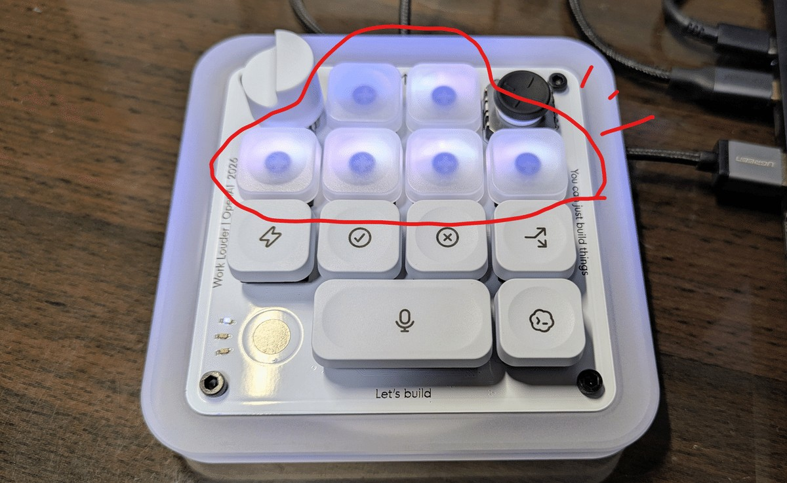
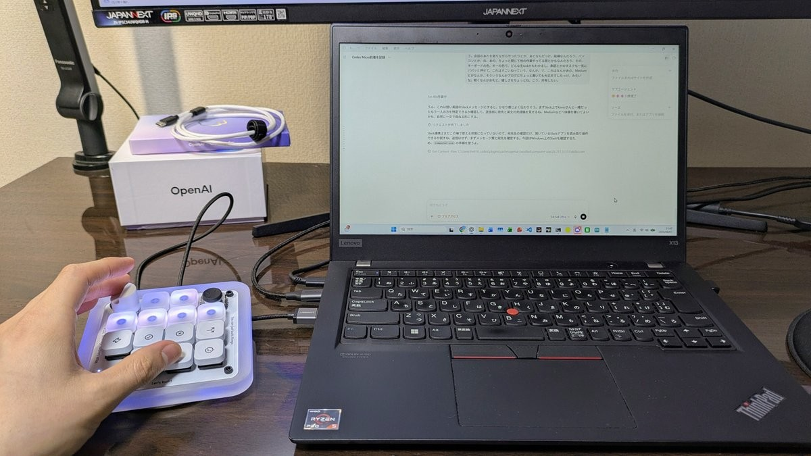
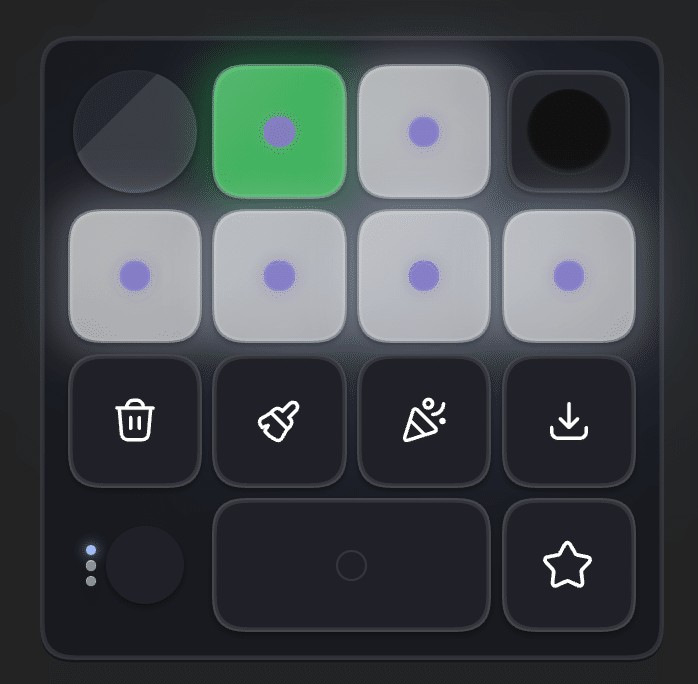
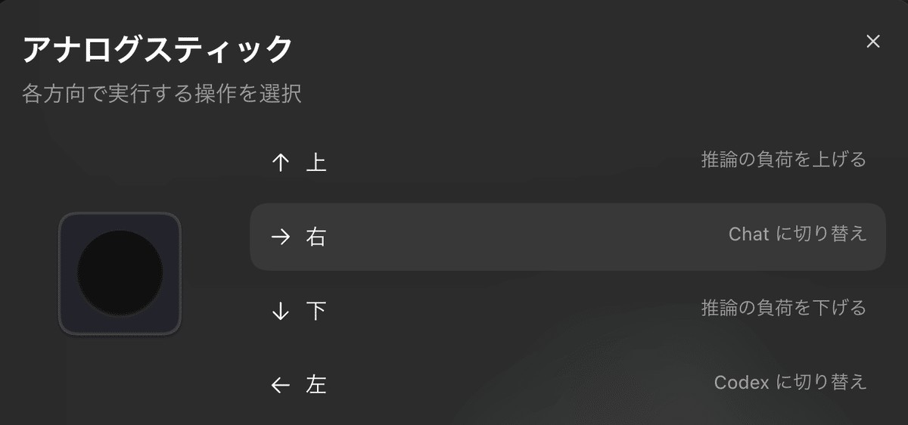

调研截止：2026-10-06。对象仅为 OpenAI × Work Louder 的 Codex Micro（kbd-1.0-codex-micro），不把 Codex 软件快捷键、Creator Micro 旧款、DIY Agent Micro 或手机仿制品当成它的评测。

## 结论先行

它是值得重点拆解的近邻产品：把「后台任务状态 → 找到对应线程 → 输入下一步」放到电脑旁的独立控制面上。最有说服力的案例不是宣传里的“旋钮调智商”，而是多任务用户看见绿灯后立即回到相应线程、按住说话，以及把重复指令做成肌肉记忆。

但这些反馈也支持一个更具体的机会：**手机副屏可展示线程名、下一步动作、上下文与确认内容，减少记忆固定键位的负担**。这仍是产品假设，尚无数据证明手机方案优于实体按键，也没有找到可靠对照实验量化 Micro 节省多少时间。

## 1. 样本边界：不能把发布日嘲讽当成用户满意度

本次重点整理 10 个不同作者/账号的第一人称使用反馈：7 个自述购买/持有者，2 个明确赠机使用者，1 个有 hands-on 视频但购机关系未披露的评测作者。另列 2 个补充线索（简短到货视频帖、技术逆向实机报告），不混入主样本。

这是搜索可见、主动发声的便利样本，不是随机抽样；无法独立核验所有购买凭证，不能算满意率、故障率或“多数用户”。同一 SithLordZX 在两个帖子讲两台设备，只算一个人。Creator Micro 2 用户、没买的 HN 评论、原型开发者均另列。最长明确使用窗口约一个月到五周；未找到大量可核验的长期追踪。

## 2. 官方事实与实际操作

### 产品身份与时间

OpenAI 官方更新明确：2026-07-15 发布，限量合作款。7 月已有到货者；未查到统一“首批出库日期”，不能把发布日期等同所有订单发货日。2026-10-06 查询两家商店均显示售罄/缺货，OpenAI 标价 $230。[官方发布记录](https://learn.chatgpt.com/docs/whats-new) · [OpenAI 产品页](https://openai.com/supply/co-lab/work-louder/)

硬件为 13 个机械开关、1 个触摸传感器、1 个旋转编码器、1 个平面摇杆；USB-C / Bluetooth，官方列 Mac / Windows。六个半透明 Agent 键显示任务状态；其余控制涉及语音、发送、确认、拒绝、快速模式和分支。宽 Mic 键覆盖两个开关，不能简单把外观键帽数量等同开关数量。它不是独立运行模型的电脑；没有本机屏幕，也没有内置麦克风。[OpenAI 产品页](https://openai.com/supply/co-lab/work-louder/) · [官方使用指南](https://learn.chatgpt.com/docs/features/codex-micro)

### 必须纠正的四个印象

1. **旋钮不是固定“模型切换器”**：当前默认是输入区导航；可选仅调推理、滚动对话、自定义。模型、推理强度和 Fast mode 不是同一个参数，宣传“调脑力”不应合并成一个能力。
2. **无需总先拿鼠标聚焦**：线程键双击可拉前窗口，当前也可设置单击聚焦。默认最近六线程，也能采用固定/优先等分配。
3. **语音有清楚的提交边界**：按住录音，双击可免手持；用电脑麦克风，录音处理后仍按发送键。实体 Mic 不是自带收音器。
4. **并非完全锁死映射**：Codex 内可配动作与技能；Work Louder Input 可配其他应用和更多层。但“能做通用快捷键”不等于第三方 agent 原生状态集成。[官方使用指南](https://learn.chatgpt.com/docs/features/codex-micro) · [Work Louder 产品页](https://worklouder.cc/codex-micro)

连接还有额外心智负担：三蓝牙通道加有线模式。两家当前文档对“插 USB 线会不会自动从蓝牙切到有线”有冲突：OpenAI 说只充电、不自动切；Work Louder 说会自动切。不能把其一写成所有固件的绝对行为，应检查实际模式。macOS 输入监控及键盘工具冲突也需排查。[OpenAI 指南](https://learn.chatgpt.com/docs/features/codex-micro) · [Work Louder 设置说明](https://worklouder.cc/openai-micro-setup)

## 实物与实际工作界面

*作者圈出的六个 Agent 键；左上旋钮、右上摇杆、大宽语音键与右下发送键。键帽是当时布局，可重映射。 来源：もりとも，2026-08-02。OpenAI赠机。 [Source](https://note.com/fair_honest9360/n/nb3eee99a5df6?hl=en).*

*左手语音＋滚动、电脑屏幕读上下文；不是独立脱离电脑使用。 来源：もりとも，2026-08-02。OpenAI赠机。 [Source](https://note.com/fair_honest9360/n/nb3eee99a5df6?hl=en).*

*真实自定义布局界面：常用技能取代默认确认/拒绝组合；图标不能直接按默认功能解读。 来源：Martin，2026-09-05。作者自述购买。 [Source](https://note.com/martins_day/n/n076a55dfba84?hl=en).*

*日文设置截图：上下调推理负荷，右切 Chat、左切 Codex；用户将不喜欢的旋钮功能移到摇杆。 来源：Martin，2026-09-05。作者自述购买。 [Source](https://note.com/martins_day/n/n076a55dfba84?hl=en).*

## 3. 用户案例：具体怎么用、哪些键真的会摸

### A. Martin：五周左右后仍每天用，带着出差

- **证据**：9 月 5 日文章；引用本人 7 月 30 日到货照片，提供真实设置截图；自述购买，未见赠机披露
- **工作流**：先做好计划，再用常见技能推进。完成灯变绿就回到线程追加；在 Chrome 工作时双击拉回 Codex
- **实际布局**：把执行计划、确认下一步、深入调研、记录对话做成键；摇杆上下调推理，左右切 ChatGPT/Codex
- **反直觉点**：作者说旋钮左右不用，认为步数偶有滑移；截图其实仍映射前/后最近聊天，说明“没用”不等于“没绑定”。按下改为 Fast mode。持续价值主要是状态感知，不是更多快捷键
- **强度**：较强的第一人称持续使用案例，无客观效率测量

[原文与设置图](https://note.com/martins_day/n/n076a55dfba84?hl=en)

### B. Atlesque：数周工作体验，推荐给多任务＋语音用户

- **证据**：8 月 4 日 Reddit；讨论静音款、欧洲运税、休眠，购买语境明确，无赠机披露
- **喜欢**：线程切换顺手，状态灯提示待审任务；专用 Mic 增加其语音使用，但办公室/公共场合例外；配对快、做工及续航感觉不错
- **不用/不顺**：高级模型选择仍拿鼠标；很少旋钮；摇杆太硬，完全不用。静音轴没预期安静，休眠醒来有时卡住，要手动换一次线程
- **适用边界**：只跑单任务、不喜欢说话的人无需买

[完整评测及评论](https://www.reddit.com/r/OpenAI/comments/1vfd91h/codex_micro_an_honest_review/)

### C. veg-n：自购一周，许多控件没有进入工作流

- **证据**：7 月 28 日明确自费，虽长期参加 Amazon 留货评测，但说本设备不属该计划
- **使用落差**：确认/拒绝/分支等几乎没用；旋钮与自己的鼠标滚动方向不一致；摇杆需要记方向且担心误触；语音被触发成不想要的 Voice mode，无法如愿用 Wispr Flow
- **可靠性体验**：短休眠、状态灯失同步、接口附近电源键难触及；评论中还报告 HID WRITE_FAILED
- **重要纠正**：他认为要先鼠标切回和不能充电用；同帖 willwang-openai 指出双击聚焦及 USB 常接可用。用户名暗示可能关联 OpenAI，但身份未核实，不能称官方回复。anomaly256 另说补权限后恢复
- **解读**：体验失败真实可记录；用户当时不知道/没成功实现的操作，不等于硬件永远不支持

[自购周记和纠正上下文](https://www.reddit.com/r/codex/comments/1v98ukr/a_week_with_the_codex_micro/)

### D. SithLordZX：两台都不响应，最后准备退款

- **证据**：8 月 8 日主帖与 Atlesque 评论为同一账号；自述买了两台、不同机器复现，更新和重置仍无效
- **体验**：无输入、无法使用，不能从这种状态评估多任务收益；最后说正在退款
- **反证保留**：同帖 Icy_Ad4276 说诊断并升级后其设备正常；PoisonSD 说日用正常，但其是 **Creator Micro 2**，不能当 Codex Micro 独立成功样本
- **解读**：证明至少存在严重个案，不支持“批量都有问题”或计算故障率

[故障帖与完整讨论](https://www.reddit.com/r/MechanicalKeyboards/comments/1vil4uy/if_you_bought_the_codex_micro_i_feel_so_sorry_for/)

### E. Aditya Bawankule：买来逆向，最在意能否接自己的工具

- **证据**：LinkedIn 第一人称明确购买；精确日期页面仅相对显示，检索截止前已发布
- **抱怨**：USB 插入后后方配对键难够；Codex 设置里找不到普通按键映射，不能做想要的 Wispr Flow 键；摇杆摩擦感和帽子自转令其觉得不值
- **边界**：他说的是 Codex 内设置体验，不应被转述为硬件完全不能重映射。现官方文档已有其他应用/层的路径
- **启示**：重度语音用户未必愿意更换现有语音引擎；输入设备应允许沿用其管线

[本人帖子](https://www.linkedin.com/posts/aditya-bawankule_i-decided-to-buy-one-of-the-codex-micro-keyboards-activity-7485518993777188864-QMx8)

### F. G9X：重度语音用户也可能完全不买账

- **证据**：7 月 27 日发帖，自述买后后悔；做浏览器 3D 仿制的作者，存在推广自己开源作品的动机
- **体验**：原以为语音重度使用会适合，但觉得没用，考虑转卖
- **证据弱点**：没有讲清具体失败动作、配置、使用天数，不能拿来证明某功能坏了；只证明“喜欢语音 → 必然喜欢专用设备”不成立

[原帖及作者回复](https://www.reddit.com/r/OpenAI/comments/1v7lbg0/i_bought_the_codex_micro_regretted_it_and_rebuilt/)

### G. tta82：喜欢且不后悔，跨工具/跨电脑是缺口

- **证据**：Atlesque 帖内直接购买体验评论，时长未说明
- **体验**：总体喜欢、不后悔；希望用于 Claude，嫌网上变通办法不好用；在其多 Mac 环境中，触摸切换设备并不总可靠
- **边界**：这是较短评论，无复现日志，不能推断所有 Mac 切换都有问题。与 Atlesque 同源页面，避免当成额外评测文章

[评论所在帖子](https://www.reddit.com/r/OpenAI/comments/1vfd91h/codex_micro_an_honest_review/)

### H. もりとも：赠机首日，发现“说话＋滚动旧输出”的组合

- **证据**：8 月 2 日明确披露 OpenAI 免费提供；有真机、桌面使用照片，属于首日，不算长期留存
- **任务**：种植实验代码修正、整理记录、写文章；多聊天并行，同时用 Chrome
- **实际动作**：左手 Mic 说下一段指令、旋钮滚动回看上下文；作者推理强度通常固定，故将旋钮改滚动
- **负面**：最初觉得鼠标足够；宣传旋钮与实际默认导航不同。单线程、选择细节文本和设置页仍鼠标快；确认/分支不常用

[首日实测，含赠机披露](https://note.com/fair_honest9360/n/nb3eee99a5df6?hl=en)

### I. Yangshun Tay：赠机一周，漂亮但增益有限

- **证据**：明确感谢 OpenAI 的 Gabriel Chua 赠机；作者称 not sponsored，但应标“赠机”，不能写无利益关系；页面无可靠绝对日期
- **常用**：最近线程导航与状态背光最多；自己把旋钮绑定推理强度
- **判断**：实体做工好，可定制；但本来 Codex 键盘支持已不错，又有 Magic Trackpad，所以附加便利更像“维生素”，不是解决刚需的工具

[本人一周使用帖](https://www.linkedin.com/posts/yangshun_ive-been-using-codex-micro-for-a-week-now-activity-7492832202913665024-mry2)

### J. Curtis Pyke / Kingy AI：写作、研究、编辑并行，六槽也会不够

- **证据**：8 月 3 日 hands-on 文章与视频；文章承认未披露买/借/赠、系统与固件版本，视频为有线使用
- **任务**：并行研究、写作、编辑，作者称会有约 20 agents；六灯用于优先任务，不是完整监控台
- **核心体验**：余光看状态、单/双击回线程更重要；图标和映射仍需学习。没有实测蓝牙距离、延迟或续航，不能把这些算通过
- **权重**：有明确操作语境的商业评测；品牌关系未知，不等同普通自费用户

[评测与视频入口](https://kingy.ai/blog/codex-micro-review/)

## 4. 不纳入主样本，但有参考价值的线索

- **oxeneers 到货视频帖**：标题“喜欢但希望有麦克风”，可确认自述持有；可访问正文无足够操作细节，不纳入主样本。[原帖](https://www.reddit.com/r/OpenAI/comments/1uzfdh4/got_my_codex_micro_love_it_so_far_but_wish_it_had/)
- **Arthur Colle 实机逆向**：记录 v0.4.1 的 USB/BLE 双向 HID、事件和灯控，自己实现语音调度；这是工程实验，不是原厂功能保证或普通购买推荐。不能把自建多 agent console 说成开箱即有。[技术报告](https://arthurcolle.github.io/codex-micro-open/)
- **Hacker News 发布讨论**：许多价格、Linux、屏幕和“为何不做手机”的意见，夹有其他 Work Louder 产品经历；本次未核实出可纳入的 Codex Micro 长期持有者。它适合研究预期/定位，不适合归纳满意度。[讨论](https://news.ycombinator.com/item?id=48923079)
- **CNET 月度实测线索**：搜到 Katelyn Chedraoui 使用一个月的原文与 CNET 10 月 1 日社交发布，但原文访问受限，未获得足够全文，不据此展开二手细节。[原文](https://www.cnet.com/tech/services-and-software/openai-ai-codex-micro-keypad-hands-on-review/)
- **YouTube**：Raúl Marín 的 27:14 西语开箱评测可定位到 04:44 开箱、08:06 配置、11:43 现场语音；尚未核验完整影像或评论，不凭视频标题编造结论。[视频](https://www.youtube.com/watch?v=AM5jzu6Be3k)
- **制造商视频**：Work Louder 联创演示可看操作，属于厂商 demo 而非用户独立评测。[视频](https://www.youtube.com/watch?v=3-2OH6ReiPM)

## 5. 随时间变化：早期问题不能直接写成今天的结论

当前官方指南已包含单击聚焦、连接冲突排查与多种旋钮模式。Work Louder 9 月固件发布记录涉及电池、蓝牙、按键和模式恢复改进，且页面包含预发布版本。**发布说明证明厂商在修这些类别，不证明上述用户个案已解决，也不应给所有人盲推同一固件。** 本次未在硬件上复测。[固件发布记录](https://github.com/worklouder/cm-v2-fw-releases/releases)

Windows 社区还出现过 7 月 15 日特定桌面版本的 native module 崩溃报告；它涉及可选设备集成加载，发帖者不一定持有设备，故不把它计为 Micro 硬件故障。[版本化报告](https://community.openai.com/t/in-app-browser-use-can-crash-codex-while-loading-its-bundled-serialport-native-module/1387051)

## 6. 对辅助输入设备的设计启示（研究推论，不是已验证结果）

### 值得保留

1. **让状态和动作共址**：同一个任务卡既显示状态又回到相应上下文。只给按钮或只给通知都不完整
2. **保留稳定少量槽位**：肌肉记忆与眼角余光有价值，不应为了“智能”不停换位置
3. **语音入口随手可达**：提供按住说、免手持、清楚录音/转录/待发送状态；发送与录制分开
4. **把常见意图做成可执行动作**：继续计划、检查下一步、解释错误、补测试，比预设一排鲜少使用的控制更值得试

### 手机屏幕的差异化机会

- 显示线程名、项目、等待原因和最后输出摘要，减少“哪个灯代表谁”的回忆
- 根据当前任务给两三个可解释的下一步，同时固定常用键；动态建议不要挤走稳定操作
- 审批卡显示动作、影响、目标和 diff，再确认。不能只因为有一个绿色实体键就让审查变盲按
- 模型名称、推理档位、Fast mode 分开可见；不靠无刻度旋钮记住当前值
- 允许用户选择自己的听写工具或复用手机麦克风，但必须明确音频流向与授权
- 把连接、失联、重连和命令是否执行显示出来；避免黑屏/熄灯同时可能表示“没任务”“休眠”“断线”

### 必须验证的代价

手机没有机械触感，用户可能必须低头看；额外屏幕会竞争注意力；锁屏、发热、耗电、局域网和权限会带来新摩擦。不要把“省掉 $230 硬件”当作工作流优势的证明。

建议一次同任务交叉实验：键鼠基线 / 固定手机控制 / 上下文建议手机控制。分单任务与 3–6 并行任务；记录回到正确线程所需时间、重复状态检查次数、命令误发与撤销、语音纠错时间、手离键盘次数、第二周主动使用频率。先验证“状态→正确行动”的闭环，再验证动态控件是否增益。
