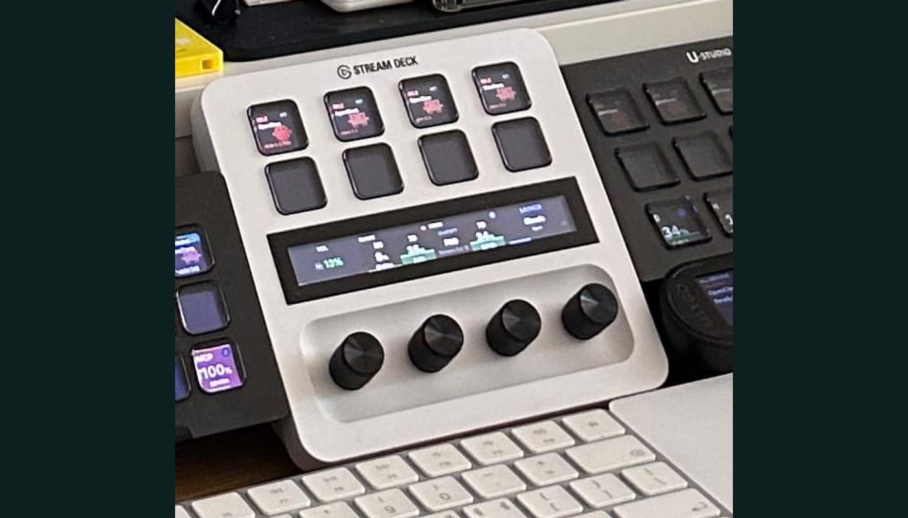
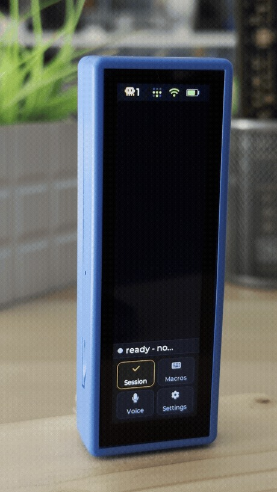
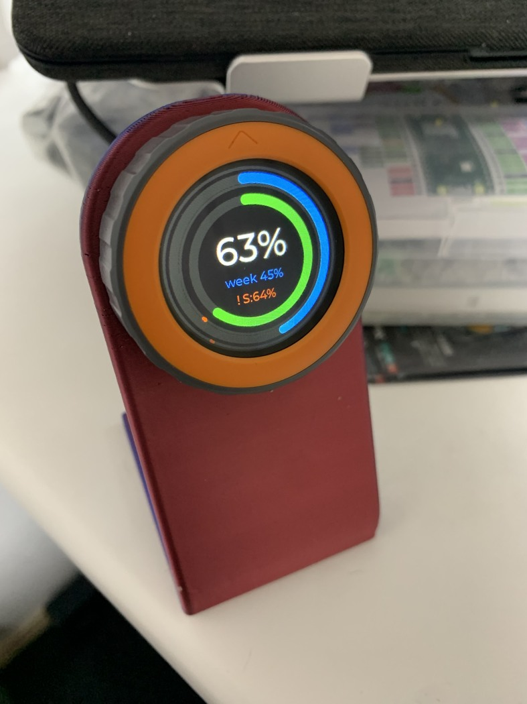
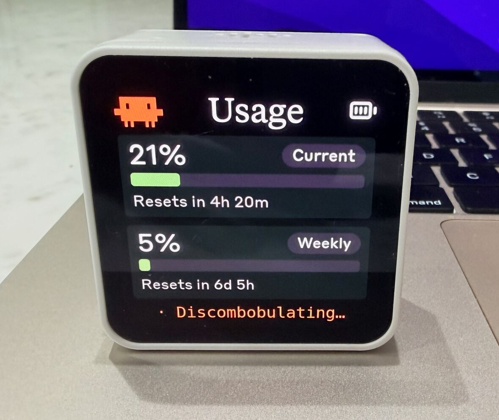
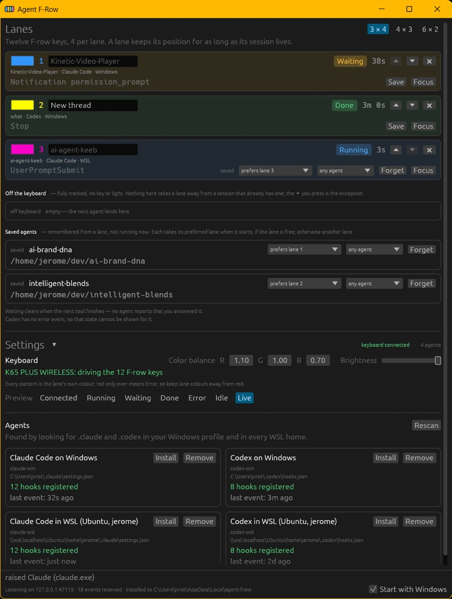
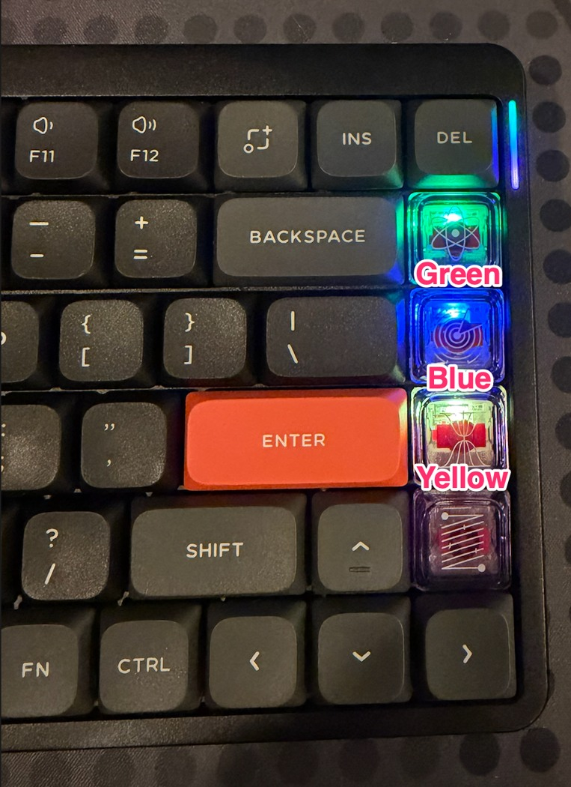
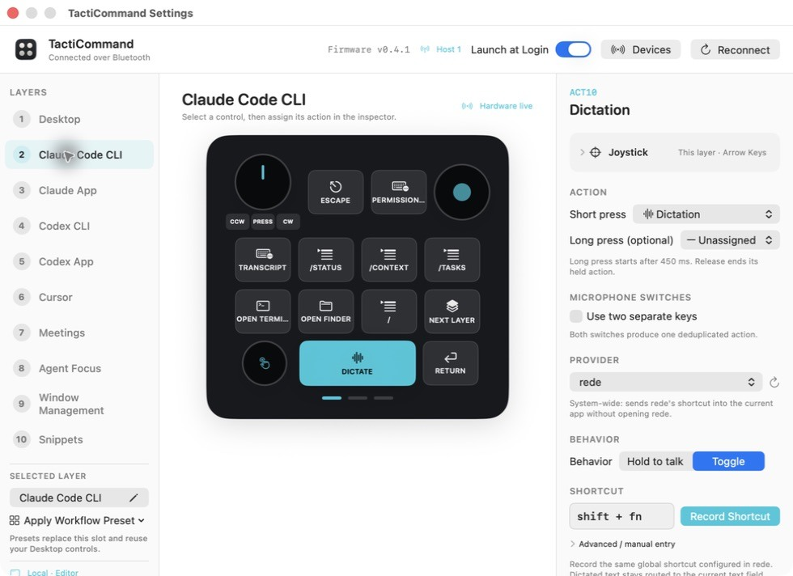
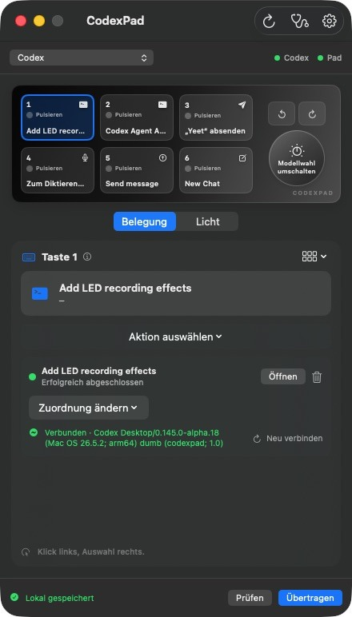
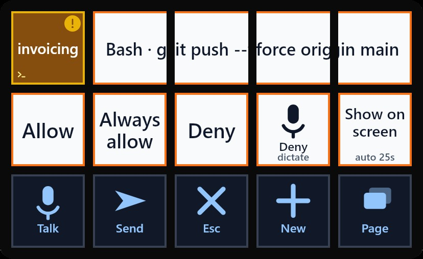

核验日期：2026-10-06。九个独立项目，不把同一AgentDeck的十几种屏幕拆成十几个用户。全部有下载并像素检查的作者照片或实际软件界面；照片、界面截图、宣传渲染严格分开。没有生成仿真图片，没有安装任何项目，也没有把作者演示当独立长期效果实验。

## 结论先读

真正高频重合的工作流，是“Agent在后台跑→我做别的→它需要我→我知道是哪一个→回到正确任务”。硬件最核心价值来自这个闭环，不来自多放一个通用AI键。语音、问题选项、额度与模型调节是不同任务，不应挤成一个万能旋钮。

尤其要区分：model（换模型）≠reasoning effort（同一模型思考预算）≠permission mode（可以自动做什么）≠usage alert threshold（额度几成报警）。Claudial旋钮只调最后一种；Agent Micro分别映射前两种；AgentDeck当前Claude/Codex只读这两项，不能以旧版宣称推断可控制。

## 方法与偏差

这是目的性先锋案例集，N=9项目；不是抽样调查、市场占有率或使用频率统计。来源偏向英语公开GitHub/Reddit、愿意DIY与写文档的编码用户；失败后未公开者、普通用户与中文生态被低估。仓库创建日期只是公开时间下限，不等于首个原型制造日。已构建是作者提供代码/照片/演示的成熟度证据，并非本研究第三方功能认证。每项成本注明估算归属；没有可信报价就明确未知。

## 九个配图案例
### 1. AgentDeck

公开仓库创建：2026-02-20；状态：作者已构建的软件/硬件；本研究未安装实测

图1｜实物照片。作者实拍 Stream Deck+：上部八键，下面横向 LCD 与四旋钮；不是水族馆概念图。README 标注整桌拍摄日期 2026-09-28。 [作者来源](https://github.com/puritysb/AgentDeck)

- 形态：Stream Deck+ 八键＋四旋钮，也可复用平板/ESP32
- 具体任务与输入：并行编码任务每会话一键；进入详情后呈现问题选项，固定 Stop；旋钮当前承担音量、Claude 额度、Codex 额度、启动器。
- 后端：本地 daemon 汇聚 hooks/日志；能否回答取决于该 session 是否有真实控制路径，显示端不都能控制。当前 Claude/Codex 模型和 effort 是只读；OpenClaw 可使用原生设置接口。
- 成本：软件开源；可先用已有电脑；外设价格未核验，不编 BOM。
- 失败/边界：旧宣传页仍有语音/模式旋钮，不能当当前默认布局；OpenClaw 设置变化以 requestId＋targetSessionKey 防串会话，超时显示不可用。
- 补充一手来源：https://github.com/puritysb/AgentDeck/blob/master/docs/streamdeck-layout.md

### 2. Claudeq

公开仓库创建：2026-06-30；状态：作者已构建的软件/硬件；本研究未安装实测

[播放作者实际设备演示短片](../../media/products/diy/claudeq-demo.mp4)

图2｜实物操作 GIF。真实竖屏设备录像；问题选项出现后手指点击，截图帧可见细长触屏、机壳及实际桌面。 [作者来源](https://github.com/Positronico/claudeq)

- 形态：Waveshare ESP32-S3 3.49英寸触屏，侧边 BOOT/PWR/RESET
- 具体任务与输入：遗漏多个终端问题时，bell 标识待答会话；点击动态选项；语音先本地转写，再 Send/Cancel；每会话分别打开 model、effort 选择。
- 后端：Node＋tmux 桥接，Wi-Fi/WebSocket；用 claudeq 启动会话；可跨 LAN/Tailscale，设备配对信任需维护。
- 成本：作者 Reddit 称约 $30 板子，不含搭建时间；本地语音需约148MB模型及 whisper.cpp。
- 失败/边界：不是普通三键 Yes：问题类型、会话身份、语音预览均需 UI；口袋误触靠长按锁屏；model/effort 通过命令输入，未独立验证每个版本行为。
- 补充一手来源：https://www.reddit.com/r/coolgithubprojects/comments/1uvwodt/claudeq_turn_a_30_esp32_touchscreen_into_a/

### 3. Claudial

公开仓库创建：2026-06-05；状态：作者已构建的软件/硬件；本研究未安装实测

图3｜实物照片。圆形彩色额度表嵌在 M5Stack Dial，安放于红色立架；中心百分比与外围双环可见。 [作者来源](https://github.com/Moge800/Claudial)

- 形态：1.28英寸240×240圆屏＋旋转编码器＋触摸
- 具体任务与输入：编程中随眼看 session/week 额度，短触选择阈值对象，旋转每格±1%，触摸静音；接近阈值双响，到达阈值红闪连续响。
- 后端：PC Go daemon 读凭证/探测 rate-limit headers，经 BLE GATT 只传数值；设备不存服务凭证。
- 成本：硬件价未复核；README估计每60秒一笔最小请求约$0.019/日，属于作者估算并非本研究账单。
- 失败/边界：这颗旋钮调警告阈值，不调模型也不调思考强度；需常驻服务、BLE、令牌续期；缓存值会变暗，离线单独显示；macOS未实测。

### 4. Clawdmeter

公开仓库创建：2026-05-11；状态：作者已构建的软件/硬件；本研究未安装实测

图4｜实物照片。白框 ESP32 屏幕放在笔记本旁，展示 Current 21%、Weekly 5%和重置倒计时；是作者上传的使用照。 [作者来源](https://github.com/HermannBjorgvin/Clawdmeter)

- 形态：ESP32-S3 2.16英寸 AMOLED＋侧按钮
- 具体任务与输入：桌边看 Claude 用量与重置时间；屏幕切换角色/额度页；左右侧键直接发 Space、Shift+Tab，用于语音和模式切换。
- 后端：主机 daemon 约60秒读取额度，经 BLE 更新；按钮是独立 BLE HID 键盘路径。
- 成本：软件开源，需板子/供电；轮询最小 Haiku 请求有非零消耗，不能把作者 basically free 当零成本。
- 失败/边界：HID不含session ID，按键去配对电脑的当前焦点；显示可留最后同步值，需检查新鲜度；蓝牙权限、配对、Token401是具体维护项。

### 5. Agent F-Row

公开仓库创建：2026-08-19；状态：作者已构建的软件/硬件；本研究未安装实测

图5｜运行界面截图。作者 Windows 应用截图：彩色会话行、状态、上下文/额度与保存配置；此图不是 RGB 键盘实拍。 [作者来源](https://github.com/timeToy34/agent-frow)

- 形态：复用 Corsair/Keychron RGB F排、数码键盘或 Stream Deck
- 具体任务与输入：F排三条四键 lane：隔着桌面发现哪一个在等人；先按键唤回正确窗口，Waiting 时再用上下/Enter回应。
- 后端：Windows/WSL hooks→本地状态机→iCUE/USB设备；验证窗口真正获得焦点后才发导航键。
- 成本：已有兼容键盘可零新增硬件；需第三方灯控/固件映射，时间成本未知。
- 失败/边界：不从 hook 返回批准；窗口内 Enter 仍可能形成用户决策。不能把没有事件解释成完成；硬件槽位有限，溢出session仍在软件里。

### 6. QMK Agent Macropad

公开仓库创建：2026-08-03；状态：作者已构建的软件/硬件；本研究未安装实测

图6｜实物照片。NuPhy Air75 V2 右侧一列彩色灯键的实际照片；对应每会话slot，不是普通RGB装饰。 [作者来源](https://github.com/pickypg/ai-agent-macropad)

- 形态：QMK键盘/Keychron数字板；历史版Adafruit12键OLED宏板
- 具体任务与输入：每agent一灯：思考、tool运行、完成、需要输入、疑似停住分开编码；按键把对应 Terminal/IDE 带前台。
- 后端：各agent hook适配→Unix socket daemon→二进制USB HID→QMK；焦点调度用macOS AppleScript。
- 成本：复用已有QMK板；需编译/刷固件与hook适配，无可复核完整BOM。
- 失败/边界：当前只有macOS焦点调度验证；VIA与daemon争独占HID，作者在最后session结束后释放；tool stalled只是超时推断。

### 7. TactiCommand

公开仓库创建：2026-09-11；状态：作者已构建的软件/硬件；本研究未安装实测

图7｜实际配置界面截图。原生Mac配置编辑器显示Claude Code CLI层、物理按键映射及动作参数；示意控制器是界面的一部分，不冒充实物照片。 [作者来源](https://github.com/aslomon/tacticommand)

- 形态：在Creator Micro 2/Codex Micro上DIY伴侣软件，十层＋旋钮/摇杆
- 具体任务与输入：按当前app临时换层，语音快捷键、取消、/context、/tasks、/diff、/review；独立Agent Focus层直达六个session。
- 后端：SwiftUI＋本地RPC/键盘自动化；从agent状态归一化RGB；语音实际由选择的dictation服务处理。
- 成本：开源；需现有商用硬件及Xcode构建；没有公证的公开二进制。
- 失败/边界：只有六个Agent键可独立RGB，其他键共用背光区；不能把软件预览的独立颜色当硬件支持；快捷键层不是语义对象识别。

### 8. Agent Micro

公开仓库创建：2026-07-17；状态：作者已构建的软件/硬件；本研究未安装实测

图8｜实际应用截图。仓库DesignQA截图，旧名CodexPad：六键映射、旋钮模型切换、已完成session与连接状态；这是应用截图，不是硬件照片。 [作者来源](https://github.com/Krypt0ph0ne/agent-micro)

- 形态：SinLoon六机械键＋一旋钮，CH552G重刷固件
- 具体任务与输入：作者配置：顶右换Claude/Codex profile；session键随运行呼吸；旋转调effort，按下开模型选择，按住旋转换model；左下按住语音。
- 后端：macOS14+本地app＋Raw HID自制协议；按压/释放事件与六独立RGB；Claude额外hooks补等待/完成/失败。
- 成本：Reddit作者标题约$25，因不愿付德国约$80运费而DIY；非可复制含税总成本报价。
- 失败/边界：源代码Developer Preview，需自己构建；仅验证特定板；刷写无法恢复原厂固件；外观相同不保证兼容；Codex集成完整度高于Claude。
- 补充一手来源：https://www.reddit.com/r/codex/comments/1vlpw6f/i_built_an_opensource_25_codex_micro_alternative/

### 9. Conn

公开仓库创建：2026-07-16；状态：作者已构建的软件/硬件；本研究未安装实测

图9｜作者提供的实际软件界面图。Conn网页/Deck的15格界面：顶部Bash命令、会话名，下面Allow/Always allow/Deny/语音拒绝及返回窗口；不把它当物理Stream Deck照片。 [作者来源](https://github.com/shawnwelsh/conn)

- 形态：15键Stream Deck或无需硬件的网页网格
- 具体任务与输入：并行Claude Code会话各一键；真实权限请求改变键面，批准/拒绝绑定请求；可口述拒绝原因，开新worktree。
- 后端：HTTP permission hooks带session；结构化decision与语音原因回同一请求。CLI进程定向与桌面可见tab快捷键路径不同。
- 成本：开源；动态解释普通选项会增加模型用量，作者写10–15秒等待；硬件可不买。
- 失败/边界：作者记录额外Return曾批准未读计划，现Waiting时禁止宏命令；桥失效/30秒超时回原对话框，绝不auto-allow；Always allow不是同义Yes。

## 功能存在矩阵：项目文档中出现，不是用户需求百分比

Y=有明确实现描述；限定=仅特定agent；导航=在正确前台窗口发上下/Enter，不是结构化approval；宏=通用宏可承载，不证明专门安全实现；?=未确证；—=本轮证据未发现，不代表绝对不存在。

|项目|语音/PTT|请求绑定批准/问题|换model|调effort|会话定位|运行/等待|额度|Stop/context|
|---|---|---|---|---|---|---|---|---|
|AgentDeck|?|Y|限定|限定|Y|Y|Y|Y|
|Claudeq|Y|Y|Y|Y|Y|Y|—|宏|
|Claudial|—|—|—|—|—|—|Y|—|
|Clawdmeter|Y|—|—|—|—|—|Y|—|
|Agent F-Row|—|导航|—|—|Y|Y|Y|—|
|QMK Agent Macropad|—|—|—|—|Y|Y|—|—|
|TactiCommand|Y|—|—|—|Y|Y|—|Y|
|Agent Micro|Y|?|Y|Y|Y|Y|—|?|
|Conn|Y|Y|—|—|Y|Y|—|Y|

只按Y数：会话定位7/9，agent状态7/9，语音5/9，额度4/9；这些数字是这个人为筛选语料的功能编码，不是市场普及率，也不是每项功能的实际使用率。模型/effort有两个明确全功能案例，另一个仅限定集成；未把其数量少自动解释为不重要。

## 优先级：重复需求＋已见操作路径＋错误后果

1. **P0：先识别目标，再显示“需要你”**。AgentDeck、Claudeq、Conn、F-Row、QMK、TactiCommand和Agent Micro重复出现会话绑定；需要展示project/session、等待原因与等待多久。单一focus只能处理眼前一个，后台队列必须可见。模型名不能代替session名。
2. **P0：Stop/Review保持稳定；批准必须带作用域**。理由来自Conn的真实误批准事故、Claudeq的动态问题与锁屏、F-Row的先聚焦再导航，以及多会话的高代价串线风险。建议触控上显示动作/对象/单次或持续授权，固定实体位置保留Stop。永不把“Always”缩成一个没有说明的Yes。
3. **P1：语音是低摩擦补充输入，要能纠正**。五案例明确提供语音入口，但有的只是HID快捷键，有的是本地转写；需区分PTT录音、转写、发送三阶段。Claudeq先review、Conn拒绝带原因比盲发Enter更有解释力。
4. **P1：额度与新鲜度一眼可见**。Claudial/Clawdmeter专用硬件，以及AgentDeck/F-Row复用显示反复出现。显示usage不等于task progress；至少列reset时间、上次更新、断连/过期。低成本环形屏可胜过缩小聊天窗。
5. **P2但必须语义正确：模型、effort、权限模式**。Agent Micro证明旋转/按住旋转可区分；Claudeq是独立菜单。要由后端提供可选值、作用范围（当前会话/全局/下一轮）和读回值，不自行编造low/medium/high。
6. **P2：上下文操作、宏与恢复**。/compact、/context、review、continue有证据；retry/pause不是本语料反复可验证的独立控制，不能宣传成市场共同标配。宏越多越要考虑配置摊销、快捷键冲突和版本漂移。

## 由案例推导的设计启示（研究建议，不声称已有产品实现）

- 固定动作区：Speak、Stop、Back/Review；动态区：目标session＋当前问题/可选项＋状态时间。状态未知时明确未知，不能只放thinking动画。
- 先绑定“这项任务”再处理“这次动作”：会话ID＋request ID＋请求有效期；模型/effort修改回读确认。目标变化要拒绝旧选择。
- 电脑端桥接是产品的一部分：安装、签名、系统权限、版本适配、重连、更新、诊断都计入体验成本。HID即插即用只保证键事件，不保证正确App、对象或任务。
- 把硬件与服务解耦：同样UI可先运行在旧手机/网页验证，再决定小屏、三键或旋钮。先验收端到端“唤回正确任务并安全处理”的时间与误触率，再计算省了几次点击。
- 扩展到Figma/PPT/Gmail还需对象API/selection/线程ID。本语料主要证明编码agent控制，不证明跨软件上下文理解。

## 附录：值得读，但不满足本轮实拍/实际截图主案例门槛

- [Claude Deck](https://github.com/Alish3r/claude-deck)，2026-07-15建库：两旋钮分别model（每chat）和effort（全局），按下compact；作者称实机验证，但能取得的图片是生产代码生成的宣传渲染，非实拍/屏幕抓图，所以不进N。其反向工程扩展patch随自动更新失效、写入后回读是重要反例；macOS尚属实验。
- [usage-touchbar](https://github.com/neelashkannan/usage-touchbar)：未找到主仓库真实截图，留线索。 [tpklo/claude-usage-touchbar](https://github.com/tpklo/claude-usage-touchbar) 的GIF明确为headless渲染，不称Touch Bar实拍；私有API及Keychain依赖值得后续验证。
- [agentpad13](https://github.com/yuz207/agentpad13)：仓库主图明确CAD render；Reddit约$65与未来agent插件承诺不能替代已集成证据。
- [claude-keys](https://github.com/WillyV3/claude-keys)：三键发1/2/3的USB HID源码已公开，但没获取实际照片；不把默认数字键误写成安全批准API。
- [脚踏路由实战](https://github.com/danielrosehill/Foot-Pedal-Dictation-Routing-KDE-Wayland)，2026-08-14：Olympus RS-27H＋KDE/Wayland；全局快捷键抢占是确定的事件路由，不是偶然race。本轮无实拍，不能凑脚踏主案例。
- [Deck for Claude](https://github.com/kotyzap/Stream-Deck-Claude-Plugin)、[Neo Agent Deck](https://github.com/m-a-b-u/neo-agent-deck)：下载到漂亮的生产renderer/宣传画，未把它们当硬件照片。前者的唤醒首键吞掉避免误批准与AX按钮文字易变很有价值。

## 商用品只作边界对照

[Work Louder Codex Micro](https://worklouder.cc/codex-micro)是购买的硬件，不作为DIY先驱独立样本；本报告TactiCommand研究的是用户自己补的软件层。Agent Micro则真正在普通廉价板上重做固件和主机桥。两者的差异是集成/可维护性与DIY成本，不是“按钮越多越智能”。

## 素材与复核

每张图保留作者来源，软件截图与实物照片明确区分；公开发布不等于任意商业再授权。Claudeq短片由作者GIF转换为H.264，未生成或补画画面。
