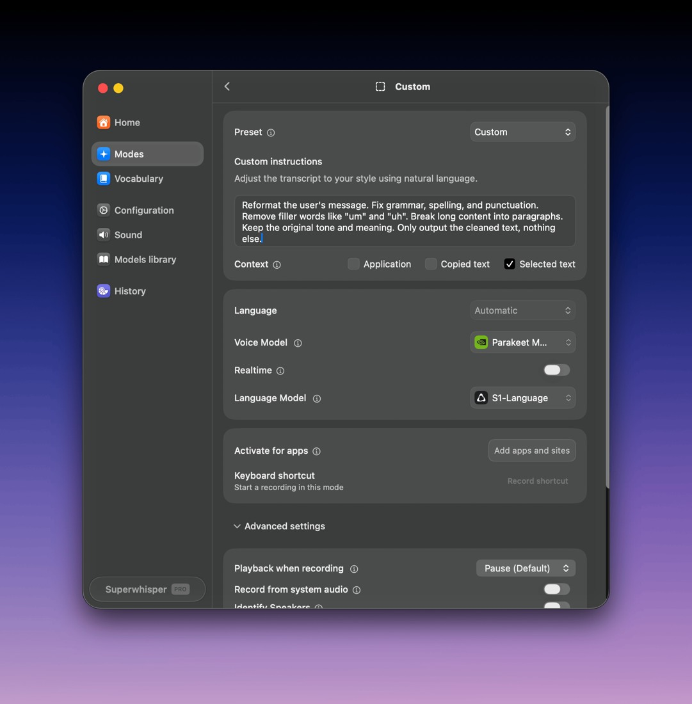
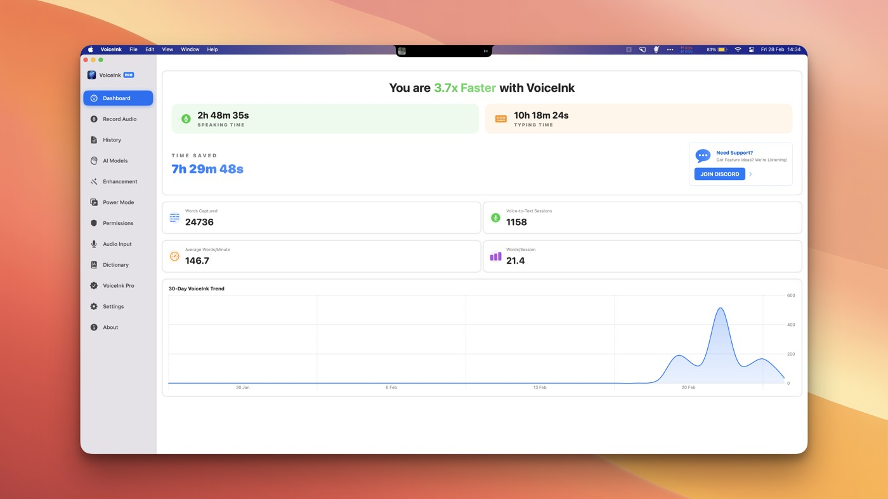
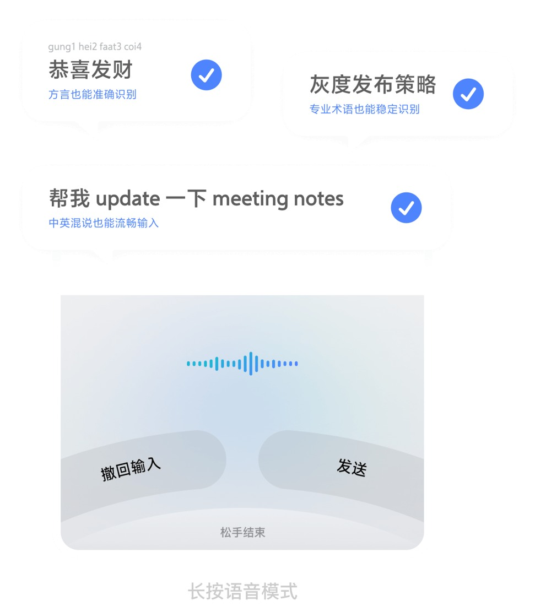
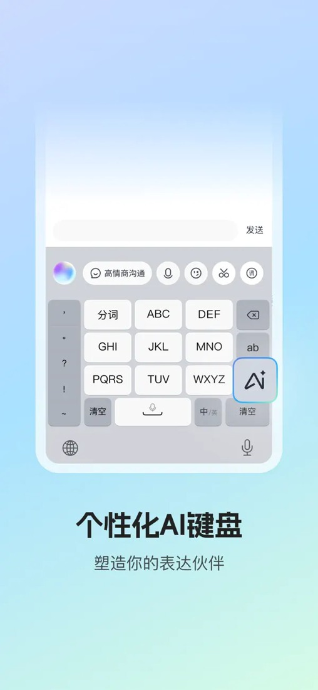
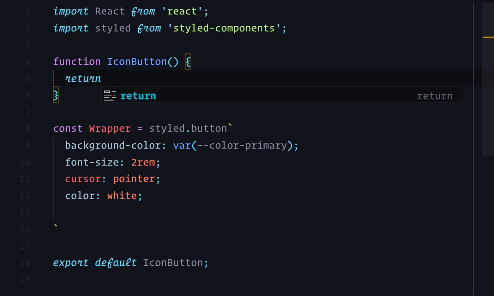

Verification date: 2026-10-06. Scope: 10 distinct products/workflows, not a download ranking. Sources include public web pages, official documentation, release notes, individual long-term usage reports, and issue records. We did not install or personally test these applications, or access private accounts.

## Executive Conclusions

1. **Voice has become an effective substitute for producing long passages of text, but has not replaced selecting the right target, supplying context, reviewing results, or approving actions.** The mainstream workflow remains: focus a text field → speak → automatic cleanup → review → send. Calling this workflow a “voice agent” obscures responsibility boundaries.
2. **The most promising hardware opportunity is not another general-purpose recording button.** Fn, mouse side buttons, holding the phone’s space bar, and double-tap hands-free recording already cover activation. The opportunity is to show the current task, target application, and recording status; distinguish “capture this,” “edit this passage,” “send this to this agent,” and “approve execution” through different actions; and provide explicit undo.
3. **The phone is a strong substitute, not just a microphone.** 咕咚 actually dictates drafts on a phone and edits them on a computer; cross-device paste was the decisive reason for choosing WeChat Input Method over Doubao. Without better task routing, reviewable delivery, and a reliable connection, another piece of hardware adds charging, pairing, and state-management overhead. [Case study](https://blog.gudong.site/2026/01/29/weiinput.html)
4. **“Local,” “AI,” and “agent” must all be evaluated layer by layer.** Local ASR followed by cloud cleanup, automatic dictionary learning, or a cloud API called from a shell still sends data over the network. Aqua MCP gives agents access to voice history and settings; VoiceInk Custom Command is a user-configured local execution output. Neither means the application itself can safely execute everything autonomously.
5. **The main risk is not merely transcription errors, but errors being “rationalized.”** For example, “delete...” intended as an instruction for a coding agent might instead cause the dictated passage to be deleted immediately, or a cleanup model might start answering a question rather than transcribing it. The control interface needs explicit “verbatim / cleanup / edit / execute” states.

## Evidence Standards and Limitations

- A: Official documentation, source code, and release records establish capabilities and boundaries, not usability or user share
- B: Named authors, original public videos, and issues with environment details establish that someone actually used the workflow
- C: Anonymous comments and store reviews provide leads about problems; identity and commercial relationships generally cannot be confirmed
- D: Vendor case studies, long-term reports with referral codes, and competitor-written reviews have an explicitly noted conflict of interest; their workflows can be extracted, but they cannot be treated as independent quality assessments
- This report does not extrapolate occupations, ages, regions, or market share beyond the sample, or equate stars/review counts with active voice users. The strongest cases concern development and writing; fieldwork, warehousing, maintenance, and other on-site occupations lack direct evidence in this sample and should remain interview hypotheses
- Older user reports explain friction mechanisms; they do not establish that an old bug still exists on 2026-10-06. In particular, iOS workflows that avoid switching apps and products’ platform coverage change quickly
- Searches surfaced identical posts across sites, referral codes, competitor SEO reviews, and Chinese download domains impersonating official sites. Capability claims use only verified official domains/store developers; claims such as “99%,” “4×,” or “zero editing” are not adopted as cross-product test results

## I. Capability Layers: Not All Natural-Language Voice Input Is an Agent

|Layer|Input/result|Core risk|Product examples|
|---|---|---|---|
|L1 Dictation/STT|Audio → text|Missing first words, dialects, numbers, paths, noise|All products; Talon distinguishes dictation from commands|
|L2 Cleanup/rewriting|Remove fillers, add punctuation, structure text|Removing intended meaning, mistranslation, unsolicited answers|Flow, Aqua, Willow, Superwhisper, VoiceInk, Doubao, WeChat|
|L3 Application-context writing|Read application, cursor-adjacent, selected, clipboard, or on-screen text before writing|Misinterpreting context, privacy exposure, incorrect mode matching|Flow, Superwhisper, VoiceInk, Aqua, Willow; scope varies|
|L4 Selection editing|“Make this passage shorter” → replace specified text|Wrong target selection, damage to original text, unclear undo|Flow desktop Command Mode; Superwhisper Custom; VoiceInk Rewrite; Aqua edit API|
|L5 Structured commands/tool actions|Explicit scripts, APIs, shortcuts, or command syntax produce side effects|Wrong targets, unintended execution, permissions, irreversibility|Talon commands/Python; VoiceInk Custom Command; Aqua MCP lets agents access voice data, rather than serving as an arbitrary executor|

L3 is not L5. “Help me send an email” appearing in an input field does not mean the input method sent an email; a language model producing an answer does not mean it invoked an email tool. Each entry below distinguishes native capabilities from externally connected capabilities.

## II. 10 Representative Products: Each with a Verifiable 3–5-Step Workflow and Actual Images/Video

### 1. Wispr Flow: Delivering Developers’ Long Prompts into Existing IDEs/Agents

**Native capabilities**: Cross-application dictation and automatic formatting. Its developer page explicitly lists terminology, camelCase/snake_case, and file tagging in Cursor/Windsurf. Desktop Command Mode supports selection editing, drafting, and search; documentation dated 2026-10-03 explicitly states that in-place text editing is currently unavailable on iOS, so desktop features cannot be assumed to exist on mobile. [Developer page](https://wisprflow.ai/developers) / [Command Mode](https://docs.wisprflow.ai/articles/4816967992-how-to-use-command-mode)

**Typical workflow**: ① Place the cursor in a Claude Code/IDE prompt field; ② hold the shortcut or use locked recording; ③ speak the task background, constraints, and expected outcome; ④ release, review the cleaned-up prompt, and add files/symbols; ⑤ submit inside the target agent and review the execution results. For selection editing, first select the text, use the dedicated Command Mode key, and then review the replacement.

**Actual use**: In a 2026-02-02 report, The Marketing Show describes approximately three months of daily use, primarily with Claude Code, as well as writing comments, commit messages, and email. The author uses Option to toggle hands-free recording while keeping their hands on the keyboard for easy corrections. The author explicitly receives referral rewards and is an affiliate, making this Category D evidence; word counts and speeds are treated only as self-reported personal dashboard figures. Reported negatives include mobile permissions/button placement and the lack of live text feedback on desktop; the author also notes that shared spaces are unsuitable. [Long-term usage report](https://themarketingshow.com/posts/wispr-flow)

**Key boundary**: Flow passes the prompt to Claude; Claude executes the development task. The verified Flow Notetaker MCP can expose meeting notes to other AI systems, which remains different from “directly carrying out tasks in any application.” [Pricing and MCP boundaries](https://wisprflow.ai/pricing)

**Media**: The official developer page includes a hands-on Tech With Tim video showing IDE prompting and file context; it is not a logo. [Video](https://app.vidzflow.com/v/Uv6aL1le89). The official site also has an illustrative iOS document-content image, but it does not show the complete recording interface and is not used as evidence of input interaction.

### 2. Superwhisper: Users Define How Each Application and Text Type Should Be Processed

**Native capabilities**: Speech models and cleanup language models are selected separately. Custom Mode offers three context types, Application, Copied text, and Selected text, and can be triggered by application/website. The official documentation source notes that blank custom instructions may produce unexpected results. [Official Custom Mode documentation source](https://github.com/superultrainc/superwhisper-docs/blob/main/modes/custom.mdx) / [Models](https://superwhisper.com/models)

**Workflow**: ① Configure an “email reply” mode with an instruction to output only the reply text; ② enable the required selection/application context and choose local or cloud models; ③ select the original text in the email and press that mode’s shortcut; ④ dictate the key points; ⑤ verify the result and people’s names before sending in the original application. This is a user-configured text pipeline, not a verified autonomous email tool.

**Real-world friction**: In an r/superwhisper post from approximately 2026-08, alexd231232 reports that the model starts answering the spoken prompt instead of typing it out. Other users report similar experiences; Nico4Real says the team is working on improvements and suggests different modes/models. Identities are recorded as public usernames; the claimed team affiliation was not independently authenticated. [Original post](https://www.reddit.com/r/superwhisper/comments/1uuiqhz/mode_keeps_replying_to_my_prompt_instead_of_just/)

**Hardware implication**: Mode is a more important state than “recording on/off.” A shortcut button that only sends Fn without showing the mode cannot prevent users from accidentally using “answer” when they intended “transcribe.”

**Actual image**: `superwhisper-context.png` has been downloaded and inspected. It clearly shows Selected text checked, separate dropdowns for the speech model and language model, and the entry point for the mode shortcut.

*Custom Mode selected-text context, separate ASR and LLM model choices, app activation and shortcut [Source](https://github.com/superultrainc/superwhisper-docs/blob/main/modes/custom.mdx).*
### 3. VoiceInk: An Auditable Local Input Layer with a Genuine Configurable Execution Output

**Native capabilities**: Modes manage transcription, cleanup, context, and Paste/Respond/Custom Command output. Screen context first undergoes local OCR, then the extracted text is sent to the selected enhancement provider. Local transcription does not guarantee that subsequent enhancement or dictionary learning also runs locally. [Modes](https://tryvoiceink.com/docs/modes) / [Context](https://tryvoiceink.com/docs/context-awareness) / [Privacy](https://tryvoiceink.com/docs/privacy-and-data)

**Workflow**: ① Configure a “project log” Mode, choosing transcription and enhancement policies; ② select Custom Command as its output; ③ press the dedicated key and dictate debugging observations; ④ VoiceInk passes the final text to a local command through stdin/VOICEINK_TRANSCRIPT; ⑤ an external script appends it to Markdown or calls the user’s own endpoint. **This is a genuine native hook for user-built actions, not a built-in general-purpose agent.** Official limitations: commands must be non-interactive, the timeout is 10 seconds, and stdout is not automatically pasted back. There is no direct success/failure notification; logs are needed. [Custom Commands](https://tryvoiceink.com/docs/custom-commands)

**Real-world friction**: mneuschaefer’s issue #687 (2026-05-06; 1.74/M1/Parakeet V3, AI enhancement disabled) includes logs showing that hotkey recordings are sometimes empty or contain only fragments. The issue is currently Closed and is not treated as an unresolved defect. Issue #257 requests that History show the active Power Mode, revealing the debugging need to know “which mode did I just use?” [#687](https://github.com/Beingpax/VoiceInk/issues/687) / [#257](https://github.com/Beingpax/VoiceInk/issues/257)

**Additional official troubleshooting boundary**: Text appearing in History but not reaching the target application is a focus/permission/paste-delivery problem, not an ASR failure. [Clipboard Issues](https://tryvoiceink.com/docs/clipboard-issues)

**Actual image**: The repository’s `voiceink-ui.png` has been inspected. It shows History, Enhancement, Power Mode, Permissions, Dictionary, and other controls, plus a statistics dashboard. This is a historical UI; the speed figures in the image are not our performance measurements. The current terminology has changed to Modes.

*Historical dashboard shows History, AI Models, Enhancement, Power Mode, Dictionary. UI statistics are illustrative, not our measurements [Source](https://github.com/Beingpax/VoiceInk).*
### 4. Aqua Voice: Text Context and Voice History Accessible to External Agents

**Native capabilities**: Formatting for the target application, Dictionary/Custom Instructions/Deep Context; the API’s operation=edit accepts selected text and spoken instructions. MCP can read history and transcripts, manage dictionaries/settings, and handle feedback. **The MCP direction is Claude → Aqua; the Linear action in the “file it as a Linear ticket” example still requires Claude’s other tools.** [FAQ](https://aquavoice.com/info/faq) / [API](https://aquavoice.com/api) / [MCP](https://aquavoice.com/mcp)

**Workflow**: ① Activate dictation in the target input field; ② dictate with dictionary/context assistance; ③ stop, review, and insert; ④ to reuse an earlier brainstorm, search Aqua history from an authorized agent; ⑤ the agent generates suggestions or processes the material through separately authorized tools. With zero recording retention, later retrievable history cannot be assumed.

**Actual use**: Ben Lovejoy (9to5Mac, 2025-08-15) reports nearly 20,000 words over two weeks, writing articles and short messages. A single-person comparison using the same passage produced good results, but still changed one phrase to a near-synonym; this cannot establish overall accuracy. Colin Hughes (2025-08-27, a public accessibility technology advocate and former BBC producer) uses KeyboardMike and appreciates the dictionary and writing adaptation, but notes that key-based activation/pasting is not completely hands-free and that background television or other speakers may also be transcribed. A DIY workaround using Apple Voice Control to send Tab also causes command words to enter the text. Both are historical hands-on reports on the versions available at the time. [Lovejoy](https://9to5mac.com/2025/08/15/aqua-voice-shows-just-how-good-mac-dictation-could-be-if-apple-just-tried/) / [Hughes](https://www.aestumanda.com/reviews/2025/08/aqua-voice-delivers-what-apples-dictation-still-lacks/)

**Media**: Hughes’s actual screenshot of Word with Aqua’s floating dictation panel, and the official Aqua Voice 2 UI video. [Hands-on screenshot](https://www.aestumanda.com/wp-content/uploads/2025/08/Screenshot-2025-08-27-at-14.07.45.png) / [Video](https://www.youtube.com/watch?v=f-2UbSC0Zxo). The official site’s hero video contains only an abstract background and has been excluded; it cannot serve as evidence of the product interface.

### 5. Willow: Context-Aware Email and Message Writing with Less Configuration

**Native capabilities**: The official workflow requires focusing a text field first, then holding Fn; releasing formats and inserts the text, while double-tapping enables hands-free recording. Surrounding text can supply people’s names and email formatting. The official privacy page states that processing is cloud-based, and the default Private Mode is not fully offline. Disabling Context Awareness stops it from reading on-screen text. [Usage guide](https://help.willowvoice.com/en/articles/10876920-dictating-with-willow-voice) / [Privacy](https://help.willowvoice.com/en/articles/12854269-how-willow-protects-your-data-and-privacy)

**Workflow**: ① Open Gmail/Slack and click the input field; ② hold Fn or double-tap; ③ dictate rough content; ④ after recording, review the salutation, tone, and body; ⑤ send manually. No general-purpose execution API was verified, so L5 capability is not assigned.

**Real-world friction**: Fragrant_Raisin_Face (approximately 2026-06) appreciates custom words and synchronization, but reports that when dictating “delete” as an editing instruction intended for elsewhere, Willow directly rewrote the entire passage. This post establishes only that user’s experience; it does not prove that cleanup cannot be disabled in every version. Speculation about privacy in the comments cannot substitute for the official policy. [Original post](https://www.reddit.com/r/ProductivityApps/comments/1trkkrq/the_one_reason_willow_voice_keyboard_sucks/)

**Actual image**: The official Gmail dictation GIF was downloaded and inspected, showing the input field, toolbar, and bottom recording capsule. `willow-demo.gif` / `willow-demo-frame.png`.

*Gmail composer with Willow listening pill; hold/release dictation workflow [Source](https://help.willowvoice.com/en/articles/10876920-dictating-with-willow-voice).*

[Play the official dictation demonstration](../../media/products/voice/willow-demo.mp4)
### 6. Doubao Input Method: Chinese, Dialects, and a Native Mobile “Hold to Speak, Release to Finish” Keyboard Workflow

**Verified capabilities**: The official site supports dialects, specialist terminology, and mixed Chinese-English input, and presents quiet speech, noisy-environment input, and long-form organization as product priorities. The App Store lists tap/long-press input, voice standby and no-app-switching operation, and one-tap send. The input method does not automatically inherit tool calling from the Doubao app. [Official site](https://ime.doubao.com/pc) / [Official iOS store page](https://apps.apple.com/cn/app/豆包输入法-豆包同款语音输入/id6752316550)

**Workflow**: ① Switch to the Doubao keyboard in a chat, note, or AI prompt field; ② hold the space bar/voice entry point to start; ③ speak a passage in Chinese or with mixed terminology; ④ release, review, and organize if needed; ⑤ send in the original application or copy to the computer. The official illustration explicitly shows “Undo input,” “Send,” and “Release to finish” together, providing more control than a design with only a recording halo.

**Actual use/limitations**: On 2026-01-29, 咕咚 reported a week of use and dictated the article’s own draft with Doubao, considering its recognition very good. However, at the time, moving a phone draft to a computer for editing required WeChat File Transfer Assistant/Feishu; that extra step led him back to WeChat Input Method. January’s lack of a PC version/cross-device clipboard cannot be treated as the October situation; the current official site already has a desktop entry point. [Case study](https://blog.gudong.site/2026/01/29/weiinput.html)

**Actual image**: `doubao-ui.png` was downloaded and inspected. It shows a voice waveform, undo, send, release-to-finish, and demonstrations of mixed Chinese-English input and specialist vocabulary. It is an official interface illustration, not our own recognition test result.

*Voice panel showing Undo input, Send, Release to finish and mixed-language/technical-word examples; illustrative claims, not a measured test [Source](https://ime.doubao.com/pc).*
### 7. WeChat Input Method: Voice Is the Entry Point; Cross-Device Delivery Determines Retention

**Verified capabilities**: The official iOS store page currently describes STT, Ask AI (DeepSeek/Hunyuan), quick text, and clipboard features. Release notes confirm text organization, a floating window that avoids switching apps, offline voice, filler removal, paragraphing, and bullet points for long content. Ask AI provides Q&A and generation within the input panel; this does not establish that it can operate other applications. [Official store page](https://apps.apple.com/cn/app/id1618175312)

**Actual workflow (Category B)**: ① 咕咚 writes a draft by voice on his phone; ② copies the result on the phone; ③ presses Ctrl+V on the computer to insert it into an editor; ④ formats and edits on the larger screen; ⑤ publishes. On 2026-02-11, he also used Mac Fn voice input to dictate an entire article, judging the free option sufficient for his needs; the shortcut could not be customized at the time. That limitation is not extrapolated to the present without verification. [Cross-device case study](https://blog.gudong.site/2026/01/29/weiinput.html) / [Mac use](https://blog.gudong.site/2026/02/11/weixin.html)

**Implication for mobile input devices**: “Remote voice input” can first produce a draft/clipboard item rather than directly control a remote agent; the goal is to reduce transfer and placement costs. Explicit task identity and confirmation are still needed before going further to send directly to an agent.

**Media**: Store keyboard UI images have been downloaded. Visual inspection of the PC push-to-talk image in 咕咚’s January article found the text “Authorize WeChat to control your computer (only for pasting text),” with ambiguity between the WeChat app and WeChat Input Method. The image is therefore not used independently to establish input-method capability; the official store keyboard interface is the main exhibit. The official homepage returned Site Unavailable during this research, and no suspected mirror download site was substituted.

*Tencent official App Store keyboard UI; current release notes independently verify voice/cleanup functions [Source](https://apps.apple.com/cn/app/id1618175312).*
### 8. iFlytek Input Method: AI Writing and Q&A Tools in a Keyboard Skill Set

**Verified capabilities**: The official store developer is iFlytek. Its description includes an AI keyboard, reorderable skill groups, chat polishing/replies/copywriting/Q&A, an AI clipboard, and translation. “Agent” here describes keyboard capability entry points, not a demonstrated third-party execution API. The iOS page explicitly says the “cursor companion” feature (“光标搭子”) is unavailable, so Android marketing cannot be applied interchangeably. [Official store page](https://apps.apple.com/cn/app/id1582446193)

**Workflow**: ① Open the keyboard in the target chat/work text field; ② use voice to produce a draft; ③ select the configured polishing/smart-reply tool in the keyboard; ④ choose and review a suitable output; ⑤ return to the original target and send. Skill-group configuration is native UI; automatic execution involving email, calendars, or agents has not been verified.

**Real-world friction**: Store reviewer “浣若” (displayed as July 31, without a separately displayed year) reports having to switch into the input-method app for voice input and then return. Current release history already lists a June floating-window feature avoiding app switching and reduced switching in September, so the old review cannot be treated as a step all current users must take. The more important issue here is the general design problem of cross-application microphone permission and focus restoration.

**Actual image**: `xunfei-ui.webp` has been inspected. It shows a nine-key keyboard, microphone, a “high-EQ communication” skill button, and an AI entry point.

*AI keyboard with microphone, communication skill, AI entry and nine-key text keyboard [Source](https://apps.apple.com/cn/app/id1582446193).*
### 9. Talon (Optionally with Cursorless): Real Voice Commands and Precise Editing, Not Merely Dictation to an LLM

**Native capabilities**: Command grammars, Python extensions, and voice/eye-tracking/mouth-noise input. Talon 1.0, released on 2026-09-20, introduced new command and dictation models, mixed mode, and UI for numbering, selections, corrections, mouse grids, and more. The older official Getting Started guide still says to add scripts first, creating a timing mismatch with the new 1.0 default command set; configuration should be version-aware. [Release notes](https://talonvoice.com/dl/latest/changelog.html) / [Official documentation](https://talonvoice.com/docs/reference/official.html)

**Workflow**: ① Enter the editor and the relevant language context; ② speak commands for variables/code structures; ③ locate the target using target markers or selection commands; ④ replace/delete/undo; ⑤ continue navigating when keyboard use is unavailable. Cursorless is an additional editor/community integration, not an LLM agent automatically bundled with Talon. [Community voice-coding guide](https://talon.wiki/Voice%20Coding/voice-coding-overview/)

**Actual use**: Josh W. Comeau’s original 2020 article, updated in 2025-02, publicly demonstrates writing a React component with Talon, selecting and correcting an incorrect word, and using eye tracking and mouth clicks. Only the publicly demonstrated requirement to reduce hand input is adopted here; no inference is made about other people's health. Direct voice coding emphasizes target selection and predictable commands, with a noticeably higher learning cost than dictating prompts. [First-hand video and workflow](https://www.joshwcomeau.com/blog/hands-free-coding/)

**Actual image**: `talon-coding.jpg` has been downloaded and inspected. It is a frame at 20 seconds from the hands-on video above, showing the editor building a React IconButton; it is not a generated illustration.

*Josh W. Comeau coding React IconButton with Talon; 20-second frame from embedded video, original 2020/updated 2025 [Source](https://www.joshwcomeau.com/blog/hands-free-coding/).*
### 10. Whispering / Epicenter: An Open-Source Prompt Input Layer with User-Selected Models

**Verified capabilities**: The current official repository’s apps/whispering README explicitly describes recording → transcription using a selected provider → optional cleanup → delivery. The Epicenter desktop host provides global shortcuts, local models, and system paste; the browser version only has in-page shortcuts and a clipboard fallback. The README contains contradictory migration statements about the browser being a “real product target” and, in its final section, no longer being a hosted deployment. Accordingly, only the desktop route is treated as a currently dependable design; the present web offering should not be treated as a stable commitment. [Current official README](https://github.com/EpicenterHQ/epicenter/tree/main/apps/whispering)

**Workflow**: ① Configure the provider/local model and shortcut; ② focus the Claude Code prompt field; ③ speak the task; ④ paste after transcription or transformation; ⑤ the user submits it to Claude Code. The voice app does not execute code; BYOK/service charges and key configuration add barriers.

**Actual demonstration evidence**: An early project README, preserved in a current fork, links author Braden Wong’s five-minute setup video and three-minute Claude Code walkthrough. The author’s claims of daily use and low API spending carry developer-promotional bias and are not pricing promises. Old installation steps cannot be carried over mechanically after the main repository’s migration. [Historical README](https://github.com/Logangriffy/whispering) / [Workflow demonstration](https://www.youtube.com/watch?v=1jYgBMrfVZs) / [Claude Code short](https://youtube.com/shorts/tP1fuFpJt7g)

**Media**: Both public videos show actual recording, configuration, and coding-prompt workflows. The videos were not downloaded; thumbnails and brand logos are not treated as evidence of use.

## III. Real Users and Tasks, Rather than Invented “Personas”

|Public user/material|Established task|Input method and subsequent actions|Limits of observation|
|---|---|---|---|
|The Marketing Show, 2026-02-02|Claude Code prompts, commit messages, email/Slack|Option toggles dictation; keyboard remains available for immediate corrections; dislikes mobile experience|Referral rewards; personal statistics cannot be extrapolated|
|Ben Lovejoy, 2025-08-15|News articles, everyday messages|Aqua/built-in microphone; article paragraphs emerge after stopping|Named journalist’s two-week experience; a single-passage comparison is not a general benchmark|
|Colin Hughes, 2025-08-27|Text creation, reduced hand operation|Aqua + external microphone; Voice Control in command-only mode sends Tab|Not completely hands-free; background speech and command-word contamination|
|咕咚, 2026-01/02|Phone drafts → computer editing, AI conversations, developer writing|Doubao/WeChat voice; cross-device Ctrl+V; later Mac Fn|One person’s comparison is not a population preference; free products are strong substitutes|
|Josh W. Comeau, 2020/2025|Actual React code and desktop navigation|Talon commands, selections, corrections, eye tracking|Precise-command paradigm, not immediate usability for newcomers|
|mneuschaefer, 2026-05-06|Everyday hotkey transcription|VoiceInk on M1/Parakeet; provides startup race-condition logs|Historical Closed issue, not a current reproduction|
|Fragrant_Raisin_Face, approximately 2026-06|Entering instructions for text editing elsewhere|Willow dictation containing delete|Content mistaken for control; single anonymous case|
|alexd231232, approximately 2026-08|Dictating prompts|Superwhisper mode answers autonomously|A lead on mode/LLM misbehavior; single anonymous case|

There are currently insufficient named examples of mobile fieldwork to claim “salespeople/doctors/maintenance workers commonly use this.” A next round of interviews could ask: while walking, with hands occupied, on weak networks, or around other people, is the task to capture a draft or immediately trigger a consequential system action? These require different devices and authorization.

## IV. Recurring Friction and Design Priorities

Ratings are this study’s qualitative judgments, not statistical scores. Recurrence means only that an issue appears across sources/products.

|Priority|Problem|Severity|Recurrence/evidence in the sample|Recommendation|
|---|---|---|---|---|
|P0|Confusion between text, editing commands, and execution commands|High; can change meaning or trigger unintended actions|Willow delete; Superwhisper answering prompts; Talon’s mode distinctions|Explicit modes, preserve original text, support undo; separate confirmation for execution|
|P0|Unclear target application/task and lost focus|High; delivery to the wrong place can leak information or contaminate a task|VoiceInk’s official paste troubleshooting; Flow only notifies when no field is focused; mobile cross-device workflows|Freeze target identity during recording; show application/task name before output; do not guess the remote target from “current focus”|
|P0|Audio captured but not successfully delivered|High; lost ideas and duplicated work|VoiceInk #687 logs; iOS reports of app switching/lost text|Distinguish listening/processing/delivered; retain a recoverable draft; make failures visible|
|P1|Chinese/mixed Chinese-English specialist terms, paths, variables, punctuation|Medium to high; code parameters may become completely invalid|Flow’s official terminology dictionary; Aqua’s single-person semantic substitution; Willow tests of technical identifiers|Retain verbatim mode, dictionaries, and selection context; prefer manual entry or selection for paths/commands|
|P1|False reassurance about cloud/local processing|More consequential than ordinary UX; involves private context|VoiceInk’s official three-layer processing explanation; Superwhisper’s two models; Willow’s cloud Private Mode|Show data destinations at each step rather than a single “local” label|
|P1|Phone → computer delivery|Medium; affects product choice for frequent writers|咕咚 explicitly switched back to WeChat for cross-device use|Prioritize routing/clipboard/task inboxes before hardware|
|P1|Shared spaces, other voices, quiet speech/noise|Medium; limits whether voice is usable|Hughes on background sound; Flow long-term user’s shared-space limits; Chinese products’ official optimization priorities|Close-talk/directional input, visible recording state, and silent alternatives; no universal noise-cancellation promises|
|P2|Cost and model/permission configuration|Medium; affects long-term retention|Free WeChat; open-source BYOK; subscriptions and mode management|Do not mistake price differences for quality differences; total cost includes configuration/correction time|
|To validate|Whether task selection by dial and physical yes/no are frequent needs|Unknown|This voice sample provides no direct evidence of demand volume|Test only in real multi-agent queues/approval workflows; voice-product popularity does not establish the need|

**Correction principle**: Voice “undo” must identify which transaction is being undone. Deleting the last recognized word, undoing a selection rewrite, canceling an unsent prompt, and recalling an external email are four different operations. Canceling a Flow recording does not recall a sent message; VoiceInk shell side effects do not automatically roll back when a paste is undone.

## V. Trade-Offs Between Physical PTT, Yes/No, a Task Dial, and the Phone

### What Software/Phones Already Cover Well
- One application, a quiet environment, and long natural-language passages: Fn/PTT/mouse side buttons are sufficient; a dedicated voice key primarily offers tactile discoverability, activation posture, or reduced hand effort, not a new capability on which to base pricing
- Short messages or drafts on a phone: existing keyboards already provide a complete set of long-press/no-app-switching/undo/send controls; no additional capture device is needed
- AI prompts requiring long context: voice can reduce the initial effort of organizing and entering content, but files, selections, screenshots, or project state are still needed; a microphone cannot solve context acquisition

### When Physical Controls May Still Be Valuable
- Multiple agents waiting simultaneously: a physical selector with names/colors/task summaries, followed by PTT directed at the chosen task; routing identity is the core value, rather than the dial itself
- Frequent yes/no approvals: buttons must show the specific target, a summary of changes, and permission risks, making “approve this action” explicit rather than blindly sending Enter/y. Reject, pause, and cancel should be separate
- Reduced hand-operation needs: a foot pedal/large button may offer more value than a key combination, but must fit the user’s actual movement capabilities; not every accessibility need is suited to pedals or sustained speech
- Capture away from the desk: phones are already carried around and have screens and haptics; a dedicated device must demonstrate less interruption and more reliable target synchronization than a phone, rather than merely better looks

### Minimum Testable Concept (Research Recommendation, Not Established Market Demand)
Start with a software prototype: before input, show “Task A / Draft mode / Local or cloud”; provide one-action PTT; deliver the result to the target task’s inbox. Provide two clearly labeled left/right buttons, “Insert draft” and “Discard,” with execution confirmed separately. Then have real users compare keyboard shortcuts, a phone, a two-button peripheral, and a dial with a display. Primary metrics: first-attempt delivery to the correct target, total time from intent to an acceptable result, number of reviews/re-dictations/manual corrections, recovery time after an error, and number of unintended actions. Do not measure transcription WPM alone.

## VI. Cost and Privacy Overview (Time-Sensitive, Not Purchase Advice)

- Flow’s current official Pro price is $15/month or $144/year; the free tier has usage limits. Context sent may include the application, cursor/selection/screen text; platform differences need to be checked. [Pricing](https://wisprflow.ai/pricing) / [Context](https://docs.wisprflow.ai/articles/4678293671-Context-Awareness)
- Superwhisper’s official Pro monthly price is $8.49; there is a free path using local Whisper models. The speech model and language model need to be checked separately; the former running locally does not make the whole pipeline local. [Official site](https://superwhisper.com/) / [Models](https://superwhisper.com/models)
- VoiceInk is open source and can be built from source; the packaged product uses a license model. Third-party pricing/minimum OS information already conflicts, so this report does not anchor to old $19/$25/$40 figures. The current README states macOS 15+; defer to the current official purchase page. [Repository](https://github.com/Beingpax/VoiceInk)
- Aqua’s official page shows a free allowance of 1,000 words and Pro/Max tiers. Monthly/annual toggles can make headline prices easy to misread; the displayed $8 should not automatically be treated as the month-to-month checkout price. The API is billed separately by usage; the official reference currently lists dictation at $0.49/hour and transcription at $0.39/hour, with a 10-second billing minimum. These are not consumer subscription prices. [API billing documentation](https://aquavoice.com/docs/api)
- Willow’s official privacy materials confirm cloud processing; review claims of a “Pro local mode” are not treated as verified functionality. Store/official-site plans change over time; this report makes no purchase-cost promises based on third-party prices
- Doubao/WeChat are currently free in their stores; iFlytek is free with in-app purchases, and charges for themes/assistants do not imply charges for basic dictation
- Talon/Whispering software costs do not eliminate learning, configuration, equipment, and model/API costs; individuals’ publicly shared bills cannot be extrapolated

## VII. Important Open Questions

1. End-to-end success rates for precise Chinese selection editing and complex mixed Chinese-English path names have not been compared under identical audio/task conditions
2. Whether sending from a phone to a remote agent actually saves time over existing copy/paste or official mobile agent clients requires observable task logs, not concept videos
3. How many people encounter multi-task routing/approval every day cannot be inferred from a handful of GitHub peripheral projects or voice-app reviews
4. Original-text retention, undo stacks, failure recovery, focus locking, and automatic sending need verification for specific versions; official marketing pages often omit this information
5. Public release of all photos/interfaces requires retaining original attribution and confirming usage rights; this directory contains research reference material and does not imply republication permission
