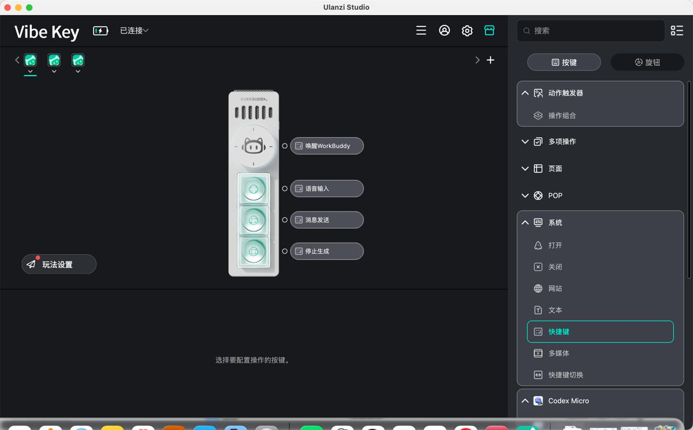
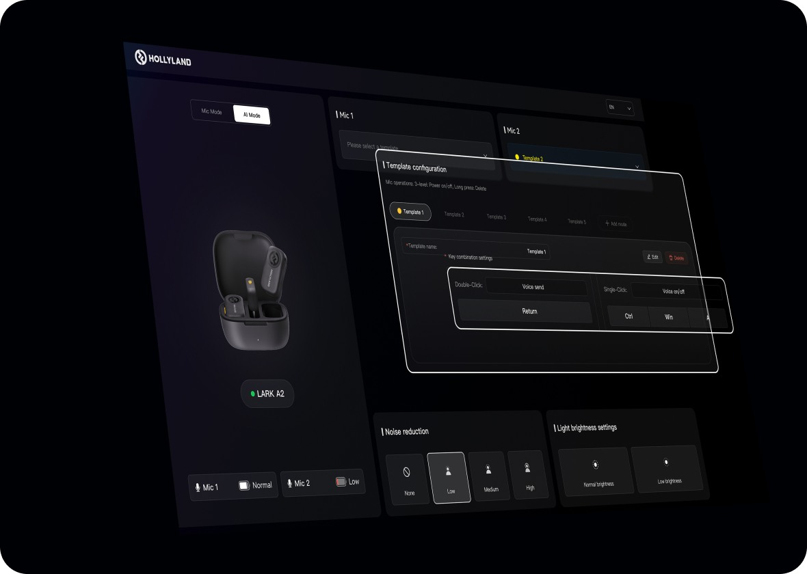

核查日：2026-10-06。研究对象是腾讯 WorkBuddy，个人版为主，企业版单独标出；不是 CodeBuddy IDE/CLI 的改名，也不是只研究语音入口。方法为公开官方文档、厂商支持页、具名媒体实测、论坛原帖和视频页面交叉核对；未进行安装或实机测试。当前官方更新日志最高为 **5.7.6 / 2026-10-04**。[S01](https://www.workbuddy.cn/docs/workbuddy/Changelog)

## 1. 一页看清产品

WorkBuddy 是将自然语言任务、可执行工具、本地/云端工作空间、可编辑产物、专业角色、团队共享知识和跨端入口整合在一起的 AI 工作台。核心不止“回答问题”，也不止“操作电脑”：它把 **给任务 → 取上下文 → 规划/调用工具 → 生成或修改文件 → 人工审阅 → 保存、分享、流转、定时再执行** 做成产品。首页覆盖日常办公、代码开发、设计创意；项目、资料库、连接器、专家/专家团、技能使任务可以持续积累。[S02](https://www.workbuddy.cn/docs/workbuddy/)

### 产品地图

| 层 | 产品中具体对象 | 对用户的作用 | 不应混淆的边界 |
|---|---|---|---|
| 入口 | Windows/macOS 客户端、Web、手机 App、小程序、微信/企微/QQ/钉钉/飞书助理、硬件 | 发任务、补材料、批准、停止、查结果 | 手机入口不代表任务一定在云端跑 |
| 执行 | 本地任务、云端任务，文件/脚本/连接器/浏览器/Computer Use | 真正读写数据、执行操作、生成产物 | 本地执行不等于本地离线推理 |
| 组织 | 任务、工作空间、项目、助理 | 临时工作、长期文件夹、团队协作、远程线程分开 | 普通任务可并行，旧式本地助理文档为集中单会话 |
| 上下文 | 当前文件、资料库、项目指令、个人记忆、引用、连接器数据 | 不用反复搬材料和重述规范 | 资料库、个人记忆、系统文件权限各自有边界 |
| 扩展 | Skill、专家、专家团、连接器、Buddy 应用 | 把工具、方法和行业场景封装复用 | 专家是角色/方法；不自动等于新增权限 |
| 交付 | Word/Excel/PPT/PDF/MD/CSV、图像/视频、网页与小程序 | 直接检查和继续编辑成果 | 可预览不等于所有外部 Office 应用原位联动 |
| 持续使用 | 定时任务、项目流转、云端产物、个人记忆 | 从一次问答走向周期工作 | 定时本地任务需要在线；跨端同步不是无限制全数据同步 |

**研究判断：** WorkBuddy 的竞争单元是整套“工作台 + 工作流 + 国内办公生态 + 端云执行”，不能用一个聊天框截图概括。与此同时，官方所说“无处不在”是生态愿景；硬件可购买、联动已上线、发布会演示三种状态必须分开。

## 2. 端与执行环境：到底在哪儿工作

| 形态 | 怎么开始 | 数据/工具在哪里 | 看结果/接续 | 核实范围与限制 |
|---|---|---|---|---|
| 桌面本地任务 | 新建任务，选工作空间，描述需求或拖文件 | 本机目录、脚本、软件、内网、已授权服务 | 对话 + 右侧产物/文件/变更/浏览器 | 必须开机、客户端在线；沙箱和审批仍生效 |
| 云端任务 / Web | 在云任务中提交要求、上传文件/用资料库 | 腾讯云隔离沙箱及云端资料 | Web/App/小程序任务接续 | 不直接读未上传的电脑目录，不支持本地完全访问选项 |
| 手机 App 连接电脑 | 桌面允许连接，手机同账号选择连接电脑 | 实际仍由电脑执行 | 可发附件、续聊/停止、看产物卡、导出 DOCX/PDF/MD 或腾讯文档 | 配对持久保留不等于电脑离线也能处理 |
| 微信助理 | 桌面助理设置扫码绑定，微信发消息 | 本地文件、Shell、凭证、MCP、浏览器扩展、Computer Use | 微信上追问、批准、收通知；桌面看完整过程 | 官方指南要求 WorkBuddy≥4.6.4、微信≥8.0.70；睡眠/断网/关闭客户端中断 |
| 企微/QQ/飞书/钉钉等助理 | 按平台机器人/授权指南接入 | 受已配置环境和权限约束 | 手机任务与桌面日志联动 | 不同平台需要不同管理权限，不能当无配置万能入口 |
| 企业项目双模式 | 项目任务输入框选本地或云端 | 本地可访问内网；云端访问项目资产与上传内容 | 团队成员在任务/项目中协作 | 企业文档明确两种模式的 AI 推理均在云端；本地的是脚本/程序执行 |

依据：[S03](https://cloud.tencent.com/document/product/1831/138797)、[S04](https://www.workbuddy.cn/docs/workbuddyapp/features/Multidevice)、[S05](https://www.codebuddy.cn/docs/workbuddy/WeixinBot-Guide)、[S06](https://www.workbuddy.cn/docs/workbuddy/From-Beginner-to-Expert-Guide/Function-Description/Assistant)。企业文档还明确：**Web 与客户端个人 Skill 库相互独立；项目 Skill 云端管理、双端可用**。本地支持自定义模型与选工作空间；云端不支持这些选项。该企业版矩阵可用于解释架构，但不能把所有企业特性无条件套给个人账号。

### 交互不是一次性投递

当前任务对话支持追加指令、输出文字/表格/组件引用、过程查看和右侧浏览器；执行中的新消息进入队列，可编辑/删除/重排，但立即发出不代表中断当前工具。产物可在文件树和变更视图检查，再上传云端网盘、腾讯文档、ima/乐享。任务可搜索、归档、置顶，9月底新增全局搜索资料库与聊天记录。[S01](https://www.workbuddy.cn/docs/workbuddy/Changelog)、[S07](https://www.workbuddy.cn/docs/workbuddy/Conversation)、[S08](https://www.workbuddy.cn/docs/workbuddy/Results)

## 3. 功能—任务—完整使用链

下列“典型使用者”是功能适用对象；只有标成“公开实测/用户自述”的行才说明确有对应人物使用。官方操作示例不能充当普通用户成功率。

| 功能 | 典型使用者与具体任务 | 触发 → 输入/上下文 → 操作 | 产物与人工审阅 | 限制/证据 |
|---|---|---|---|---|
| 本地文件处理 | 行政：按日期、主题、类型整理一批票据/合同/图片 | 选目录或拖文件 → 读取内容/时间属性 → 先列新旧文件名 → 确认后改名 | 对照表、完成/跳过数量；检查原件和备份 | 受目录权限保护，批量任务宜先小批试跑；官方示例 [S09](https://www.workbuddy.cn/docs/workbuddy/From-Beginner-to-Expert-Guide/Practice-Cases/Practice-One) |
| 会议与外文材料 | 运营/研究：会议记录整理、外文视频转写翻译 | 交录音/文本/视频材料 → 提取、重组、翻译 | 纪要、要点、待办/结果文件 | 需检查说话人、术语及关键结论；官方示例 [S09](https://www.workbuddy.cn/docs/workbuddy/From-Beginner-to-Expert-Guide/Practice-Cases/Practice-One) |
| 数据分析与可视化 | 经营分析：销售额/利润按月份和产品线汇总 | 拖 Excel/CSV 或给路径 → 指定口径/时间/图表 → 统计与画图 | 图表、结论、完整报告文件 | 官方建议分轮补要求，明确数据来源可信度；不是默认商业判断正确 [S10](https://www.workbuddy.cn/docs/workbuddy/From-Beginner-to-Expert-Guide/Practice-Cases/Practice-Three) |
| 调研报告 | 市场/产品：近一年AI办公工具市场资料 | 指定主题、范围、来源 → 搜集结构化数据 → 分析排版 | 有来源的可视化报告 | 必须另核来源时效、口径；不是联网即可靠 [S10](https://www.workbuddy.cn/docs/workbuddy/From-Beginner-to-Expert-Guide/Practice-Cases/Practice-Three) |
| 人机双写·文章 | 江宇（媒体记者）：检查当天文章、框选数据转表、按批注修改 | 上传文档 → 右侧腾讯文档编辑器选区/批注 → 对话让AI原位修改 | 建议先检查再批准，编辑结果写回文档 | 7/30媒体测试V5.3.5；熟练Office用户小修改可能自己更快 [R01](https://zhidx.com/p/581004.html) |
| 人机双写·报销 | 同一记者：行程单/发票整理为报销表 | 上传票据 → 字段提取汇总 → 追加金额阈值标色与图表 | 可编辑表格，可逐项对原票 | 样本小且规整，不代表复杂财务数据稳定率 [R01](https://zhidx.com/p/581004.html) |
| 人机双写·PPT | 同一记者：往年PDF述职材料转同风格PPT | 上传PDF → 复刻风格 → 追加指定页图片/表格 | 可编辑演示；人工看布局/事实 | 三个任务是同一篇测评，不是三名用户 [R01](https://zhidx.com/p/581004.html) |
| 设计创意 × Ardot | 产品/运营/设计：登录页、落地页、海报、发布会PPT | 首页设计创意 → 首次Ardot授权 → 选风格/素材占位或生图 → 框选/语言/参考图修改 | 画布预览、浏览器Ardot精修，PPTX/PDF等导出，继续生成应用代码 | 画布在云端；细节交付需人工编辑；官方演示流程 [S11](https://www.workbuddy.cn/docs/workbuddy/From-Beginner-to-Expert-Guide/Function-Description/Design-Idea) |
| 网页应用 | 小团队：课程预约系统、智能客服 | 说明角色/操作/存储需求 → 生成网页 → 确认数据库/认证/存储 → 预览改动 → 发布 | 独立访问链接；更新需重新发布，链接保留 | 发布内容对拿到链接者可见；下线保留数据，删除不可恢复 [S12](https://www.workbuddy.cn/docs/workbuddy/From-Beginner-to-Expert-Guide/Function-Description/App-Publishing/Web-App) |
| 微信小程序 | 商家/行政：预约、报名、器材借用、读书清单 | 明确微信小程序 → 生成 → 预览 → 开云服务 → 托管上传/审核/发布 | 试用/体验版真机核验，然后提交微信流程 | 内嵌预览≠微信真机；登录等要真机测；行业资质/微信审核仍存在 [S13](https://www.workbuddy.cn/docs/workbuddy/From-Beginner-to-Expert-Guide/Function-Description/App-Publishing/Mini-Program) |
| Git与并行开发 | 开发者：同仓库多个独立改动 | 选Base Branch → Worktree任务创建隔离分支 → 并行开发 | 文件变更/终端/预览中审阅 | 文档声明分支自动命名；不能等同CodeBuddy所有IDE功能 [S14](https://www.workbuddy.cn/docs/workbuddy/From-Beginner-to-Expert-Guide/Function-Description/Worktree-Task) |
| 专家 | 非专家办公用户：用法务/运营/数据角色的方法处理问题 | 专家中心选角色 → 给材料和目标 → 角色方法+工具链执行 | 专业视角的报告/建议/文件 | 专家自己不增加系统权限；非持证专业服务保证 [S15](https://www.workbuddy.cn/docs/workbuddy/From-Beginner-to-Expert-Guide/Function-Description/Expert-Center) |
| 专家团 | 复杂项目：多角色分工出完整成果 | 选团队 → 团长拆解任务 → 多专家并行 → 汇总 | 综合交付，用户需核一致性 | 长任务和自定义模型曾有用户中断反馈，版本相关 [S15](https://www.workbuddy.cn/docs/workbuddy/From-Beginner-to-Expert-Guide/Function-Description/Expert-Center)、[R02](https://linux.do/t/topic/2418174) |
| Skill | 重复流程使用者：复用整理/写稿/调用API脚本 | 市场安装或上传包，或描述需求创建 → 自动/手动触发 | 实际执行流程和交付文件 | 第三方技能可能外传数据，需核来源/权限；开关不等于卸载 [S16](https://www.workbuddy.cn/docs/workbuddy/From-Beginner-to-Expert-Guide/Function-Description/Skills-Market) |
| 连接器 / MCP | 办公用户：读会议、文档、邮箱、网盘，创建日程/通知 | 授权QQ邮箱/腾讯文档/会议/TAPD/乐享等 → 任务调用 | 查询结果或外部服务中的实际变更 | MCP+CLI或Skill+CLI；按需授权后可续跑；国内/海外目录不同 [S17](https://www.workbuddy.cn/docs/workbuddy/From-Beginner-to-Expert-Guide/Function-Description/Connector) |
| 独立Agent邮箱 | 给助手转发材料、请它总结并起草回复 | 开通agent.qq.com独立身份 → 收件通知 → 整封邮件/附件加到对话 → 总结/回复/转发 | 端内邮件列表、对话结果；对外发送要确认 | 不是个人QQ邮箱连接器；查看不扣积分、AI处理扣积分 [S18](https://www.codebuddy.cn/docs/workbuddy/From-Beginner-to-Expert-Guide/Function-Description/Mailbox) |
| 项目 | 团队：统一规范下开展任务并交给下一位同事 | 项目指令/资料/工具/专家设置 → 新任务自动继承 → 分享/流转 | 任务文件+进度摘要+处理人/状态/截止日期一起交接 | 连接器可公共或个人授权；项目自动化仅创建者可见 [S19](https://www.workbuddy.cn/docs/workbuddy/From-Beginner-to-Expert-Guide/Function-Description/Project) |
| 资料库 | 团队知识管理：积累文档、表格、页面而非聊天附件散落 | 新建/上传/剪藏/指定Agent写入 → 带入下一任务 | MD、CSV、HTML互相引用；可做动态台账页面 | 和本地文件夹、ima个人知识库、乐享企业知识库不能混写 [S20](https://www.workbuddy.cn/docs/workbuddy/From-Beginner-to-Expert-Guide/Function-Description/Library) |
| 多人多Agent协作 | 团队：同份MD修订、HTML协作 | 建团队空间/授权 → 划词评论 → AI修订建议 → 接受生效 | 评论线程、修订、共同编辑 | Agent只读用户有权访问内容；企业可限制组织外协作 [S21](https://www.workbuddy.cn/docs/workbuddy/From-Beginner-to-Expert-Guide/Function-Description/Library/Collaboration) |
| 记忆 | 持续使用者：保持偏好、关系和近期事项 | 默认开启 → 每夜提取会话 → 相关记忆用于下次任务 | 设置中看/改/删/关闭，可从其他AI导入 | 自动抽取可能需更正；记忆提取不额外扣积分，官方称不向第三方共享 [S22](https://www.workbuddy.cn/docs/workbuddy/From-Beginner-to-Expert-Guide/Function-Description/Memory) |
| 定时任务 | 运营/负责人：每日简报、周报、定时数据处理 | 名称+prompt+目录+模型/技能+时间规则 → 到点自动跑 | 文件存指定位置；可推小程序/企微、看历史和产物 | 本地配置和执行需在线；有并发/频率/时长限制；不能当无限常驻自主Agent [S23](https://www.workbuddy.cn/docs/workbuddy/From-Beginner-to-Expert-Guide/Function-Description/Automation-Guide) |
| 手机远程 | 通勤/出差者：在外取回电脑文件、补需求/批准 | 同账号配对或IM绑定 → 发送任务/材料 → 电脑执行 | 手机产物卡、停止/续聊、回桌面继续 | 依赖在线电脑和原权限，非远程桌面逐像素操控 [S04](https://www.workbuddy.cn/docs/workbuddyapp/features/Multidevice)、[S05](https://www.codebuddy.cn/docs/workbuddy/WeixinBot-Guide) |
| 微信聊天交接 | 博主/办公用户：长串需求转最终待办 | 桌面微信多选记录 → 系统分享给WB → 从记录识别需求 | 摘要/任务，继续追问 | Mac微信教程有版本前提；手机转发边界未统一核实 [R07](https://www.bilibili.com/video/BV1E1eh6kEUg/)、[R08](https://www.majiabin.com/3438.html) |
| Browser Use / Computer Use | 需要网页或应用操作的人 | 配置扩展/能力并授权 → 任务调用工具 | 对话展示工具过程、浏览器预览，按权限确认 | 当前日志证明存在，但本轮未跑跨应用实机任务；不能由“有工具”推断所有网站可稳定完成 [S01](https://www.workbuddy.cn/docs/workbuddy/Changelog)、[S05](https://www.codebuddy.cn/docs/workbuddy/WeixinBot-Guide)、[R09](https://omnitools.ai/article/workbuddy-2) |
| Buddy行业应用 | 行业用户：使用带业务上下文的专属工作台 | 进入行业应用 → 专属首页+专家/技能/连接器 → 发起任务 | 领域工作成果/服务调用 | 正式生态入口；发布伙伴数量不是经验证的活跃用户数 [S24](https://open.workbuddy.cn/) |

### 几条可直接解释“为何用它”的完整链

1. **记者写稿**：刚写好的Word → 在工作台右侧打开 → 选中成绩段落转表格 → 在对应段落留修改批注 → 让Agent执行 → 检查原文。价值是减少聊天窗口与文档之间搬运，而非只生成另一份回答。证据是具名记者的实际操作，但样本有限。[R01](https://zhidx.com/p/581004.html)
2. **非研发办公室团队**：领导要求下载 → 部门部署内部Skill（需求、产品、测试方向） → 员工用报告/PPT任务；一位用户认为过慢，另一位回复说办公好用。这是真实组织推广线索，但公司不具名、没有持续部署数据。[R03](https://linux.do/t/topic/2589796)
3. **团队项目接力**：管理员配置项目规范与工具 → 成员A生成分析材料 → 把产物、进度摘要、处理人与截止日期流转给成员B → B在上下文中继续。是文档可核的协作机制，不是普通聊天链接分享。[S19](https://www.workbuddy.cn/docs/workbuddy/From-Beginner-to-Expert-Guide/Function-Description/Project)
4. **Plaud会议后续**：先由录音设备采集 → Plaud完成转写/摘要并云同步 → WorkBuddy连接器经授权检索 → 做周报/客户方案/跟进邮件草稿 → 人工核对再发。MCP读取既有成果，不负责开始录音或重新转写。[H03](https://www.ithome.com/0/997/585.htm)、[H04](https://support.plaud.ai/hc/en-us/articles/57751078986265-Plaud-MCP)
5. **小商家轻应用**：描述课程预约、学生登录与名额保存 → 生成带后端应用 → 开云服务 → 预览 → 发布 → 后续改动手动更新线上版。可实用的产品链已写进官方教程；本轮未发现独立商家持续运营账单或留存案例。[S12](https://www.workbuddy.cn/docs/workbuddy/From-Beginner-to-Expert-Guide/Function-Description/App-Publishing/Web-App)

*官方配置界面，非本次实测。[图源](https://docs.ulanzistudio.com/vibekey/en/au05-x/)*

*官方配置图：语音与快捷键映射，不代表本次购买或可靠性实测。[图源](https://www.hollyland.com/product/lark-a2)*

## 4. 硬件生态：9款 / 8品牌，逐个分清证据

2026-09-02发布会是八品牌九款：Plaud、Rokid、Insta360（两款）、Ulanzi、科大讯飞、Anker、Hollyland猛玛、京东京造。发布会上摆出联名设备，**不代表九款当日全数开卖、联动全量上线**。中国证券报记者张兴旺确认9/2事件；具名现场记者毕伟豪确认体验过程。某DoNews稿写9/3且明确“智能模型自动生成”，不采用它定事件日期或唯一证据。[H01](https://www.cs.com.cn/ssgs/01/2026/09/02/detail_2026090210036517.html)、[H05](https://www.itiger.com/hant/news/2664810300)

| 产品 | 自身硬件/交互功能 | 怎样接WorkBuddy、实际任务链 | 2026-10-06证据支持的状态 | 仍缺什么 |
|---|---|---|---|---|
| **Ulanzi AU05-X / Vibe Key 联名键麦** | 3键+旋钮，麦克风，默认/快速派活/多任务预设 | 电脑USB-C接收器，出厂一对一配对；按键语音、确认、取消，旋钮会话操作；默认WB预设可直接用，自定义/切模式需Studio≥3.3.6 | **有完整厂商操作文档**，不是仅舞台概念；Windows10+、macOS12+ | 本轮没完成下单库存验证/长时间普通用户测评；快捷键映射不是语义级任意对象控制；WorkBuddy单段语音最多60秒，长段需拆分；部分第三方输入软件需关闭Ulanzi Studio后台才能读取快捷键 [H02](https://docs.ulanzistudio.com/vibekey/au05-x/) |
| **HOLLYLAND猛玛 LARK A2 联名无线麦** | 领夹收音、降噪、7小时标称续航，接收器/Web设定，热键模板 | 官方联名页：单击唤醒语音输入、长按删除、双击发送；默认WB预设，Web可配5套热键 | **厂商联名页+正式产品/手册页**，按键流程可核；标准硬件和联名固件/地区仍需区分 | 200m为无遮挡实验标称，非现实办公室保证；未得独立购买后联动稳定率 [H06](https://www.hollyland.com.cn/workbuddy-collaboration-event/)、[H07](https://www.hollyland.com/product/lark-a2) |
| **Plaud Note Pro WorkBuddy 联名款** | AI录音卡，录音/转写/总结是Plaud侧工作 | 两条路线：Plaud App内Ask WorkBuddy生成PPT/方案；WB经官方MCP读取云同步的录音转写/总结/行动项 | 合作稿明确 **Ask WorkBuddy与MCP已上线，联名款及更多功能后续上线** | 不能用现有Note Pro正常销售证明联名款已发货；实际联名SKU/上架尚未核实 [H03](https://www.ithome.com/0/997/585.htm)、[H04](https://support.plaud.ai/hc/en-us/articles/57751078986265-Plaud-MCP) |
| **Insta360 Wave** | 桌面/会议室全向麦，录音与会议场景，展示WB内容 | 采会议音频→接入Agent→纪要/待办/后续材料；厂家合作表述经发布稿可核 | 9/2合作公告，9/4报道写 **即将升级/未来承担音频入口** | OTA最低固件、逐步开放、绑定流程和全部链路独立复现未核，不能说买来即可全流程 [H08](https://g.pconline.com.cn/x/2181/21815587.html) |
| **Insta360 Mic Pro** | 移动领夹麦，彩色墨水屏（报道），外出采访音频采集 | 采访/会谈录音→上传WB→转录、总结、待办 | 和Wave同一次合作，**有展示/接入宣布** | 不把腾讯会议联名款、WB联名款、普通硬件混为一物；可售和WB能力上线分别核 [H08](https://g.pconline.com.cn/x/2181/21815587.html) |
| **京东京造 JOY A1 智能录音卡** | 现场声音采集、转写 | 录音内容送WB→纪要、关键结论、待办 | 品牌官方微博9/1写 **即将上线**，预告9/2发布会 | 本轮未获正式手册、账号绑定/云同步步骤、10月库存与用户复现；不能补造蓝牙直连路径 [H09](https://weibo.com/2/detail/5338342339641554) |
| **讯飞AI翻译耳机（未核实更细型号）** | 发布会称多语言实时同传 | 听会谈→同传→梳理要点/纪要/商务邮件 | **联名展示与合作声明可核** | 未找到品牌型号/固件对应WB操作手册；拒绝采用SEO文声称A1 Pro/A2 Max/Neo为“官方唯一支持型号” [H05](https://www.itiger.com/hant/news/2664810300)、[H10](https://m.php.cn/faq/3177031.html) |
| **安克桌面AI伴侣（未核实商品型号）** | 桌宠/桌面交互，显示状态和关键待办的演示概念 | 语音/触屏派活→WB云端任务→屏上状态/确认 | 现场报道与安克工作人员采访可核；为WB定制SKU，**尚无本轮确认的正式销售/手册** | 不能凭展台写现货；机构二次摘要称年底上市，未取得品牌一手日期，不作为已发售 [H11](https://www.eeo.com.cn/2026/0904/1023455.shtml)、[H12](https://timeline.sohu.com/news/LdCVbGXw4I?from=news) |
| **乐奇Rokid AI眼镜（联名具体型号未核）** | 麦克风、摄像头、眼前交互页面 | 现场记者：语音唤醒WB→拍照上传→搜索 | **记者现场体验过这段短链** | 没有长期购买者验证；眼镜拍照搜索成功不能扩写成全自动会议/邮件闭环已成熟 [H05](https://www.itiger.com/hant/news/2664810300) |

### 真正的整合路线至少有三类

- **电脑音频+快捷键外设**：AU05-X、LARK A2。它们降低启动、口述、发送、切任务的操作成本；执行能力仍在WorkBuddy。不是独立计算/离线Agent。
- **既有垂直App+MCP/Agent嵌入**：Plaud。硬件先捕捉、App先转写，再让WorkBuddy处理下游工作；这条路径最清楚地解释“录音之后发生什么”。
- **专用Agent终端/视听入口**：安克桌宠、Rokid眼镜、其他发布会终端。价值在现场输入、状态和确认，但完整消费可用链路的公开证据显著薄于前两类。

硬件名单不能用作九个独立用户成功案例；九款也不意味着九套不同Agent智能。

## 5. 真实用户声音：把人、任务、版本和商业关系写清楚

不把点赞数当满意率，不把同文转载当独立样本。论坛为自述，身份/设备/版本通常不可核；评论中的原因猜测与实际现象分开。

| 编号 | 来源、作者、日期/版本 | 真正做了什么/观察什么 | 喜欢/痛点对应功能 | 权重与利益关系 |
|---|---|---|---|---|
| R01 | 智东西江宇，2026-07-30，自称V5.3.5 | 文章、报销票据、旧PDF转PPT三个操作及截图 | 喜欢同份文档直接改、不再搬运；小修改人手更快；规整样本局限 | 具名记者第一人称；发布期媒体稿，未见赞助披露，不能断言商业独立 |
| R02 | Linux DO tiz hihua8（用户名tizhihua8）、malim、soule，6/16–6/30，未写版本 | 自定义模型专家团/长任务、少量文档和小bug | 自定义模型更易中断、长任务中断、更新频繁；文档/小任务尚可 | 普通论坛自述，无测试日志；一条企业版销售广告排除 |
| R03 | Linux DO randomfuk、Kurakl等，7/15–7/16 | 被领导要求安装，创建专家、PPT、按MD搜索；另一人称部门购企业版开发内部Skill | 抱怨工作链过慢且复杂；另一回复办公好用；组织推广有时非主动需求 | 匿名职场自述、无精确版本/产物；耗时不作benchmark |
| R04 | Linux DO cxuanAI教程及PixlPanda评论，9/1 | 教程展示分析/专家/资料库；评论称简单小任务会用 | 正面为免配置、傻瓜式；不够专业 | cxuanAI内容作者；评论是轻量实际使用，自述商业关系不明 |
| R05 | Linux DO salsal101、472965913、weiyong996，9/11–9/12 | 改设置、优化Skill；有人跑轻量任务 | 用户称小设置耗时半小时，Skill两小时仍在优化；轻量任务尚可 | 无复现实验；“内置提示词过长导致”是评论者猜测，不是确定根因 |
| R06 | Linux DO CCTV911及11条可读回复，9/26–9/27 | 启动领积分、长会话、输入法延迟 | 启动卡、长会话卡、工具偶有空返回；至少两人表示自己正常/流畅 | 未报统一硬件/版本；与9/28、10/3修复先后相关，不能说当前所有人仍卡 |
| R07 | B站森虫虫进化中，9/19，视频6:09 | 微信多次变更需求转给WB梳理 | 强调省下复制/截图步骤，小任务因此更愿意交AI | 自述AI博主、有商务联系；仅读取简介，未看全片/评论，无虚构成功率/时间戳 |
| R08 | 老马/majiabin，Mac微信4.1.13教程 | 多选微信记录经系统分享给WB | 能减少资料搬运；当时手机App不支持、需官网微信版本 | 个人第一人称图文教程，不能代表后续版本所有端 |
| R09 | AI教员，公众号原文6/30、工具研究所转载7/1 | 把Qoder Work的Computer Use能力迁到WB；第一次截图其实用Python，后来配MCP才调用成功 | 揭示“任务成功”不等于“用了所声称的工具”，技能还需执行连接 | 作者技术实操，非开箱默认体验；不把旧DIY能力和现有内置能力混写 |
| R10 | B站项目管理课程，9/18，BV1pHe16sEdj | 分集讲定制专家、看板、项目周报、TAPD/企微/文档联动，专设不足章节 | 说明项目/工具整合有教学需求，不能仅按聊天产品评估 | 页面推广1v1课程；只核页面分集和简介，不当独立无利益评测 |
| R11 | B站苏星河牛通，7/13，BV15VNm6BETv | 页面为WorkBuddy正面短评，百万级播放 | 证明曝光与内容营销，不证明真实办公效率 | 作者公开商务联系；没核赞助，不把标题“杀疯了”当客观测试结论 |

### 从反馈能合理说什么

- **确定的正面产品点**：具名文章实测支持原位共同编辑；9月论坛轻量用户认可免配置、简单任务；部分跨端用户认可能看到电脑任务并回复。[R01](https://zhidx.com/p/581004.html)、[R04](https://linux.do/t/topic/2838397)、[R12](https://linux.do/t/topic/2722657?tl=en)
- **具体痛点1：任务粒度不匹配**。把小修改交给复杂Agent链，等待/解释成本可能超过手工。7月与9月自述均出现，不能全归因于模型知识。
- **具体痛点2：长流程可靠性**。专家团、自定义模型、长会话、授权连接/恢复有历史中断反馈；官方日志确有相应修复，但修复声明不证明所有现场问题已消失。
- **具体痛点3：运行可见性和启动负担**。用户感觉“卡着/还在处理/空返回”影响是否信任交付；这是UI、运行时和环境组合问题。论坛对根因的扫盘/杀毒/提示词推测没有证实。
- **证据仍不足**：普通财务/HR/销售用户连续数周业务成功率、付费后真实成本、硬件购买后留存、团队规模扩张后的权限/协作事故。不能用“节省一天到一小时”的单句感叹写成定量结论。

## 6. 最近版本、成本和安全决定了能不能用

### 版本快照

官方5.7.6（10/4）修复本地新任务失败、PPTX预览、云助理无回复；5.7.5（10/3）增加定时任务汇总时间线/产物通知，修复长会话记录不全和取消后丢上下文；5.7.0（9/28）有全局搜索、工作区信任确认；5.6.0（9/19）记录Browser Use兼容Edge/QQ浏览器、工具展示和语音改进。[S01](https://www.workbuddy.cn/docs/workbuddy/Changelog) **这些是版本存在与历史故障的证据，不是当前仍有故障或已百分百修好的证据。**

版本资料也有矛盾：7/30媒体把V5.3.5称为当日上线，官方日志却列5.3.5为7/25、5.3.6为7/28。保留媒体测试自述，不以它精确断言版本首次发布日期。[R01](https://zhidx.com/p/581004.html)、[S01](https://www.workbuddy.cn/docs/workbuddy/Changelog)

### 个人版价格（官方页，2026-10-06抓取）

| 档位 | 普通月付 | 连续包月 | 年费 | 基础积分/月 | 资料库 |
|---|---:|---:|---:|---:|---:|
| 体验 | 免费 | — | — | 500 | 5GB |
| 标准 | ¥99 | ¥70 | ¥672 | 2,000 | 10GB |
| 高级 | ¥199 | ¥140 | ¥1,344 | 4,000 | 20GB |
| 旗舰 | ¥999 | ¥700 | ¥6,720 | 20,000 | 50GB |

有限时赠积分与限免权益，不能固定写成永久赠送；WorkBuddy/CodeBuddy同账号共享积分。连续订阅自动续费；加量包官方页为1000积分¥50、有效1月且生效不退款。实际任务成本随模型/调用链变化，不能拿积分数简单等同任务数量。[S25](https://www.workbuddy.cn/docs/workbuddy/Pricing)

### 安全和结果验收

默认权限会在敏感路径、重要删除、脚本/网络高风险操作前确认；完全访问减少拦截，不能当推荐默认。技能可能调用脚本及发送数据给第三方；项目公共授权和个人授权不同；团队空间权限同样约束Agent。助手独立邮箱对外发送保留确认。高风险动作有按钮不能替代产物正确性检查。[S16](https://www.workbuddy.cn/docs/workbuddy/From-Beginner-to-Expert-Guide/Function-Description/Skills-Market)、[S17](https://www.workbuddy.cn/docs/workbuddy/From-Beginner-to-Expert-Guide/Function-Description/Connector)、[S18](https://www.codebuddy.cn/docs/workbuddy/From-Beginner-to-Expert-Guide/Function-Description/Mailbox)、[S19](https://www.workbuddy.cn/docs/workbuddy/From-Beginner-to-Expert-Guide/Function-Description/Project)、[S21](https://www.workbuddy.cn/docs/workbuddy/From-Beginner-to-Expert-Guide/Function-Description/Library/Collaboration)、[S26](https://www.workbuddy.cn/docs/workbuddy/From-Beginner-to-Expert-Guide/Function-Description/Permission-Modes)

## 7. 图像与视频来源

图片应写明是厂商示意图/文档截图/记者现场照片，不标“本次亲测”。第三方图片链接用于引用核验，不自动代表获得再发布授权。

| 素材 | 直接URL/所在页面 | 建议图注 | 状态 |
|---|---|---|---|
| Ulanzi配置界面 | https://docs.ulanzistudio.com/assets/05-device-page.B7jgh8zc.png | 厂商教程中Vibe Key设备页：唤醒、语音、发送、停止四类映射 | 图片链接打开成功；来源H02 |
| LARK A2按键交互 | https://cdn.moma.com.cn/product-resource/workBuddy/WorkBuddy-pc-5.1-1.webp | 官方联名页按键语音工作流配图；具体单击/长按/双击以正文为准 | 图片链接打开成功；来源H06 |
| LARK A2语音编码控制 | https://cdn.hollyland.com/file/product/lark-a2/images/vibe-hands-free.png | 全球产品页展示语音+快捷键，区别于普通收音功能 | 图片链接打开成功；来源H07 |
| 软件人机双写全景/选区/批注/表格 | https://zhidx.com/p/581004.html | 7月30日江宇公开实测：左侧任务、右侧可编辑文档 | 页面可读，图片源单独打开失败，不伪造下载路径 |
| 项目配置、流转、项目资产截图 | S19官方项目文档 | 项目把指令、连接器、技能与资料交给后续任务 | 文档可读，部分download.codebuddy.cn图片直开失败 |
| Ardot画布选区与风格模板 | S11官方文档 | 对话生成→画布局部调整→浏览器精修→导出/生成代码 | 可在源页面核验 |
| 九款硬件现场照片 | https://www.itiger.com/hant/news/2664810300 | 毕伟豪9/2发布会现场报道；展示不等于已发售 | 全文及图片链接目录可读；原发布方智东西 |
| B站微信记录工作流 | https://www.bilibili.com/video/BV1E1eh6kEUg/ | 森虫虫进化中9/19：聊天记录转交；全长6:09 | 仅核页面简介，未取得可证实分段时间戳 |
| B站项目管理课程 | https://www.bilibili.com/video/BV1pHe16sEdj/ | 9/18项目管理教学；第7集定制专家3:27，第8集看板3:02，第9集周报1:43，第11集不足8:28 | 这些是**分集时长，不是全片时间戳**；未观看内容，不生成引语 |
| B站苏星河短评 | https://www.bilibili.com/video/BV15VNm6BETv/ | 7/13内容传播样本，非效果统计 | 只核作者与标题/日期；没有伪造评论 |

## 8. 可直接用于竞品对比的判断

1. **覆盖广度强**：文档/数据/设计/应用开发、团队项目、连接器与国内办公服务在一个产品中，是比“万能问答”更完整的工作台。
2. **上下文已产品化**：项目资产RAG、个人记忆、任务流转、引用、共享资料库、原位编辑均不是空白；竞争者不能只提出“避免复制粘贴”就宣称新类别。
3. **硬件整合成熟度不均**：AU05-X、LARK A2的控制映射和Plaud的MCP有可执行文档；部分九款联名仅达到展示/合作宣布。应该分别标“文档可操作”“厂商称已上线”“记者短链演示”“等待版本/未知”。
4. **明显的使用摩擦**：启动/长会话/长任务稳定性、模型与工具配置边界、为小任务付出的编排等待，是比抽象“AI还不够聪明”更可检验的痛点。
5. **缺少足够自然场景验证**：公开材料多发布期媒体、培训和技巧推广，普通业务用户长期证据少。这是研究局限，不是可以倒推“没人用”或“必然可靠”的理由。

## 9. 来源台账

官方滚动文档均于2026-10-06读取，未显示稳定发布日期时不自行补造。文档提供功能承诺与使用步骤；不是独立体验评价。

### 软件主来源
- S01 更新日志：https://www.workbuddy.cn/docs/workbuddy/Changelog
- S02 产品简介：https://www.workbuddy.cn/docs/workbuddy/
- S03 腾讯云企业项目双模式：https://cloud.tencent.com/document/product/1831/138797
- S04 App多端协同：https://www.workbuddy.cn/docs/workbuddyapp/features/Multidevice
- S05 官方微信助理：https://www.codebuddy.cn/docs/workbuddy/WeixinBot-Guide
- S06 助理：https://www.workbuddy.cn/docs/workbuddy/From-Beginner-to-Expert-Guide/Function-Description/Assistant
- S07 任务对话：https://www.workbuddy.cn/docs/workbuddy/Conversation
- S08 结果查看：https://www.workbuddy.cn/docs/workbuddy/Results
- S09 文件处理官方实践：https://www.workbuddy.cn/docs/workbuddy/From-Beginner-to-Expert-Guide/Practice-Cases/Practice-One
- S10 数据分析官方实践：https://www.workbuddy.cn/docs/workbuddy/From-Beginner-to-Expert-Guide/Practice-Cases/Practice-Three
- S11 Ardot设计：https://www.workbuddy.cn/docs/workbuddy/From-Beginner-to-Expert-Guide/Function-Description/Design-Idea
- S12 网页应用：https://www.workbuddy.cn/docs/workbuddy/From-Beginner-to-Expert-Guide/Function-Description/App-Publishing/Web-App
- S13 小程序：https://www.workbuddy.cn/docs/workbuddy/From-Beginner-to-Expert-Guide/Function-Description/App-Publishing/Mini-Program
- S14 Git并行开发：https://www.workbuddy.cn/docs/workbuddy/From-Beginner-to-Expert-Guide/Function-Description/Worktree-Task
- S15 专家：https://www.workbuddy.cn/docs/workbuddy/From-Beginner-to-Expert-Guide/Function-Description/Expert-Center
- S16 技能：https://www.workbuddy.cn/docs/workbuddy/From-Beginner-to-Expert-Guide/Function-Description/Skills-Market 与 https://open.workbuddy.cn/docs/skill
- S17 连接器：https://www.workbuddy.cn/docs/workbuddy/From-Beginner-to-Expert-Guide/Function-Description/Connector 与 https://open.workbuddy.cn/docs/connector
- S18 我的邮箱：https://www.codebuddy.cn/docs/workbuddy/From-Beginner-to-Expert-Guide/Function-Description/Mailbox
- S19 项目：https://www.workbuddy.cn/docs/workbuddy/From-Beginner-to-Expert-Guide/Function-Description/Project
- S20 资料库：https://www.workbuddy.cn/docs/workbuddy/From-Beginner-to-Expert-Guide/Function-Description/Library
- S21 协作：https://www.workbuddy.cn/docs/workbuddy/From-Beginner-to-Expert-Guide/Function-Description/Library/Collaboration
- S22 记忆：https://www.workbuddy.cn/docs/workbuddy/From-Beginner-to-Expert-Guide/Function-Description/Memory
- S23 自动化：https://www.workbuddy.cn/docs/workbuddy/From-Beginner-to-Expert-Guide/Function-Description/Automation-Guide
- S24 开放平台：https://open.workbuddy.cn/ 与官方接口 https://open.workbuddy.cn/docs/openapi
- S25 定价：https://www.workbuddy.cn/docs/workbuddy/Pricing
- S26 权限：https://www.workbuddy.cn/docs/workbuddy/From-Beginner-to-Expert-Guide/Function-Description/Permission-Modes

### 硬件与生态来源
- H01 张兴旺/中国证券报，2026-09-02，具名报道：https://www.cs.com.cn/ssgs/01/2026/09/02/detail_2026090210036517.html
- H02 Ulanzi厂商教程：https://docs.ulanzistudio.com/vibekey/au05-x/
- H03 Plaud合作声明转载，IT之家9/2，作者栏空，明显品牌口径且引语尾有“暂定”，不能当独立测评：https://www.ithome.com/0/997/585.htm
- H04 Plaud官方MCP支持页，9/22更新：https://support.plaud.ai/hc/en-us/articles/57751078986265-Plaud-MCP
- H05 毕伟豪/智东西，9/2现场体验，老虎转载全文：https://www.itiger.com/hant/news/2664810300 ；新浪转载 https://finance.sina.cn/stock/jdts/2026-09-02/detail-iniqnawn4570896.d.html
- H06 Hollyland官方联名活动页：https://www.hollyland.com.cn/workbuddy-collaboration-event/ （模板残留2024日期，**不能作真实发布日期**）
- H07 Hollyland正式产品/支持：https://www.hollyland.com/product/lark-a2 与 https://www.hollyland.com/support/lark-a2 （手册标9/8）
- H08 影石合作公告报道，PConline9/4：https://g.pconline.com.cn/x/2181/21815587.html
- H09 京东京造品牌微博9/1：https://weibo.com/2/detail/5338342339641554
- H10 讯飞未核型号的反面来源，PHP中文网SEO文，**排除其型号与步骤断言**：https://m.php.cn/faq/3177031.html
- H11 经济观察网9/4现场采访：https://www.eeo.com.cn/2026/0904/1023455.shtml
- H12 发布会展示详解，搜狐转载：https://timeline.sohu.com/news/LdCVbGXw4I?from=news （身份/商业关系信息不足，安克显示细节仅低权重补充）
- H13 雷科技三明治，受邀参会9/2现场，明确有未完善的其他终端：https://origin.leikeji.com/article/79118

### 体验与用户来源
- R01 https://zhidx.com/p/581004.html
- R02 https://linux.do/t/topic/2418174
- R03 https://linux.do/t/topic/2589796
- R04 https://linux.do/t/topic/2838397
- R05 https://linux.do/t/topic/2891946/1
- R06 https://linux.do/t/topic/2953154?tl=zh_CN
- R07 https://www.bilibili.com/video/BV1E1eh6kEUg/
- R08 https://www.majiabin.com/3438.html
- R09 https://omnitools.ai/article/workbuddy-2 （原公众号 https://mp.weixin.qq.com/s/g7gw7msJQh85mugdKnsG7g ）
- R10 https://www.bilibili.com/video/BV1pHe16sEdj/
- R11 https://www.bilibili.com/video/BV15VNm6BETv/
- R12 Linux DO Visor 8/8跨端评论：https://linux.do/t/topic/2722657?tl=en

### 明确降权/排除
- https://www.donews.com/news/detail/4/6696290.html 标注AI自动生成且日期和其他现场报道不同；不作九款上市证据。
- https://www.cocoloop.cn/t/topic/2792 标题4/11声称深度用了三个月，可能含内测但没证据解释；不作为三个月普通用户验证。
- https://techminds.cn/blog/zh/workbuddy-ai-office-agent-review-2026/ 有affiliate披露，缺可审查原始任务材料；不采用“每天省一小时”等数字。
- https://cloud.tencent.cn/developer/article/2704221 自称使用一月，作者用户12605672、开发者分享季；缺版本和产物，用作低权重线索，不把“误删重要文件”等写成确认事故。
- Reddit关于公司培训的帖子作者自述没参加、未使用，不作为产品体验；本轮没有编造Reddit/YouTube评论。

## 10. 待实机复核清单

已完成公开证据层的全产品梳理，但“全面研究”不应伪装成未做过的亲测。优先补证：①当前个人版本地/云端功能矩阵；②同份复杂Office文件多人/AI并发修改和撤销；③8小时长任务/锁屏/断线恢复；④9款硬件准确SKU、固件、地区、库存与订阅依赖；⑤普通HR/财务/销售真实材料任务回放。每项应保存版本、模型、原始输入、执行记录、输出、耗时、人工修正，才可形成跨产品公平比较。
